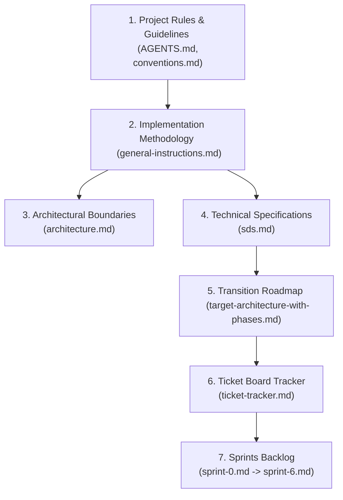

# Conventions

Refer to [general-instructions.md](../../docs/sprints/general-instructions.md) for detailed workflows.

<!-- @section:rules-core — D1-D6, security, TDD (needed by all agents) -->

## 0. Naming Conventions

- **Go struct fields**: use `username` in domain structs.
- **DB columns / API JSON**: use `username` — matches SDS schema.
- The entity field maps to the DB column;
- **Command/Query handlers (target)**: commands use `*Handler` suffix (e.g. `FollowUserHandler`), queries use `*Resolver` suffix (e.g. `GetFollowersResolver`). See SDS §2 for target state. Legacy code may use `*Handler` for both.

## 1. Stack

- **Go 1.25**, stdlib preferred, `slog` logging, `kin-openapi` validation.
- **Module path**: `social-network`. **Entry point**: `cmd/server/main.go`.
- **SQLite**: WAL mode, busy timeout, `db.SetMaxOpenConns(1)`. Tests use in-memory instances.
- **Frontend**: Next.js, TailwindCSS, `shadcn/ui`, ESLint + Prettier. Vitest (planned) + React Testing Library + Playwright (planned).
- **Ports**: BE `:8080`, FE `:3000`.

## 2. Vertical Slices & Boundaries

- **Layout**: `internal/<feature>/` → `<feature>.go`, `commands/`, `queries/`, `transport/`, `store/`.
- **D2 Interfaces**: Within-slice: full `Repository` from `<feature>.go`. Across-slice: consumer defines narrow interface, wired in `bootstrap/bootstrap.go`.
- **D3 Cross-Slice**: ID-only references (never embedded structs). Sync checks via consumer interfaces. Side-effects via Event Bus pub/sub.
- **D4 DB Factory**: Stores accept `platform/database.DB` interface, not `*sql.DB`.
- **D5 Import Rules**:
  - `<feature>.go` + `commands/` + `queries/`: MUST NOT import own `transport/` or `store/`. MAY import `platform/eventbus` (interface only).
  - `commands/`, `queries/`: import own feature root, define cross-slice interfaces locally. MUST NOT import `store/` or `transport/`.
  - `transport/http.go`: imports own root + `commands/` + `queries/` + `core/session/`. MUST NOT import `store/`.
  - `store/sqlite.go`: imports own root + `platform/database`. MUST NOT import `transport/`, `commands/`, `queries/`. Add `// Used by: <Command/Query>` comments.
  - `bootstrap/bootstrap.go`: composition root — imports everything.
- **D6 Dependency DAG** (acyclic): `user → follow/topic → comment/vote → group → event → chat → notification`. `notification` is pure subscriber — never imported.
- **No cross-slice SQL joins**. Each slice owns its tables exclusively.
- **Event Bus error isolation**: subscribers must `defer recover()`.
- **Feature toggles** for incomplete work (e.g. `config.Features.Follow`).

## 3. Strangler Fig Migration

1. Write contract tests against OLD API.
2. Build NEW slice alongside old code.
3. Verify contract tests pass against NEW slice (identical results).
4. Swap routing to NEW slice.
5. Monitor for regressions.
6. Delete OLD code only after full verification. No partial deletion — old code stays until ALL its features are migrated.
7. Delete contract tests after old code removed.

- **Route prefixes**: new = `/api/`, legacy = `/api/v1/`. Both coexist during migration.

## 4. TDD & Go Style

- **Red-Green-Refactor**. Write failing test first, always.
- Table-driven tests with `t.Run()`. Run `go test -race ./...`.
- **Test naming**: `Test<Handler>_<Scenario>`. Contract: `Test<Feature>Store_Migrated_SameAsOld_<Method>`.
- **Test files**: `commands/<use_case>_test.go`, `store/sqlite_migration_test.go` for contract tests.
- **Testing pyramid**: ~300+ unit, ~50 integration, ~20 E2E (Playwright, planned).
- **OpenAPI 3.0**: spec per feature in `docs/api/<feature>.yaml`. BE validates via `kin-openapi`. FE mocks via `msw`.
- **Goroutine recovery**: all WS read/write loops and client goroutines must `defer recover()`.
- **RateLimiter**: any `time.Ticker` must have `stop chan struct{}` to prevent leaks.

## 5. Database Migrations

- Sequential: `000001_name.up.sql` / `000001_name.down.sql`.
- Never drop column in same migration as replacement. Add → populate → drop in next migration.
- Delimiter: `";"` (never `":"`).
- Rollback: revert last migration manually (no dedicated rollback script yet).
- Test each migration: up → verify → down → verify clean.

## 6. Security

- bcrypt cost ≥ 12. Wipe plaintext passwords from memory immediately.
- SQL: parameterized queries only (`?` placeholders). No string concatenation.
- ORDER BY: whitelist `["ASC", "DESC"]`. Never interpolate raw input.
- File uploads: validate MIME via `http.DetectContentType` (first 512 bytes). Allowed: `image/jpeg`, `image/png`, `image/gif`.
- WebSocket: validate origin in `CheckOrigin` (never unconditional `true`). Timeouts: `writeWait=10s`, `pongWait=60s`, `pingPeriod=54s`, max msg 512KB.
- Session cookies: `HttpOnly`, `Secure`, `SameSite=Lax`.
- **Session isolation**: different browsers/profiles must maintain independent sessions. Non-logged-in browsers = guest.
<!-- @section:rules-core:end -->

<!-- @section:rules-fe — Frontend standards (needed by FE agents) -->

## 7. Frontend

- **Structure**: `src/app/`, `src/components/ui/`, `src/components/features/`, `src/lib/`, `src/styles/`.
- **Build gates**: `bun run lint`, `bun run format:check`, `tsc --noEmit`, `bun run test`.
- File upload limit: 10MB client-side validation (size + extension).
- Design system: HSL palette, glassmorphism (`backdrop-blur-md bg-slate-900/70 border border-white/10`), Inter/Outfit fonts, `transition-all duration-200 ease-in-out`.
- Destructive ops require `shadcn/ui` Dialog confirmation (unfollow, privacy toggles, decline requests).
- Notifications panel (bell icon, unread count) must be visually distinct from Chat.
- Real-time notifications via SSE (`GET /api/notifications/stream`) with 15s polling fallback.
- **Chat gate**: non-followed users cannot chat. Show: _"At least one user must follow the other to initiate a chat."_
- Pre-commit: `gofumpt`/`goimports` (BE), `prettier --write`/`eslint` (FE). Pre-push: `go vet ./...` + `go test -short ./...` + `go build ./...` + `go-arch-lint check` (BE), `tsc --noEmit` + `bun run lint` + `bun run test` (FE).
<!-- @section:rules-fe:end -->

<!-- @section:rules-ci — CI gates, build commands (needed by gate-running agents) -->

## 8. CI & Verification

- **`make install`**: Install ALL project dependencies (Go modules, root JS tooling, `.env`, SSL certs, Go dev tools, git hooks, frontend deps). One command for new devs.
- **`make setup`**: Install Go development tools + git hooks only (subset of `make install`).
- **`make be-ci`**: Legacy blanket check: `ci-mod → check-format → lint (staticcheck + golangci-lint + govulncheck) → test`. (Use `make format` to auto-format.)
- **`make be-ci-new`**: Scoped check for new vertical slices and new code: `ci-mod → check-format-new → lint-new (staticcheck-new + golangci-lint-new + vet-new + vulncheck-new + gosec-new) → test-new`.
- **`make fe-ci`**: Frontend CI target. Scopes to `frontend-next/` (if it exists) or falls back to legacy `frontend/` or skips if neither exists. Runs: `bun run lint → bun run format:check → tsc --noEmit → bun run test`.
- **`make review-gates`**: Decoupled from legacy CI. Gating pipeline: compiles all code (`go build ./...` for sanity), runs Go verification gates (`go run cmd/gates/main.go --all`), and executes new-code scoped checks (`be-ci-new` and `fe-ci`).
- **`make setup-hooks`**: Install lefthook pre-commit/pre-push hooks.
- **Standalone commands** (when not using `make`):
  ```
  go vet $(NEW_PKGS)
  go build ./...
  go test -race -coverprofile=coverage.out $(NEW_PKGS)
  golangci-lint run --timeout=5m $(addsuffix /..., $(NEW_DIRS))
  govulncheck $(NEW_PKGS)
  go run cmd/gates/main.go --all
  ```
- **Pre-commit hooks** (lefthook, staged files only):
  - Backend: `gofumpt -l {staged_files} | xargs -r gofumpt -w` + `goimports -w -local social-network {staged_files}` (`stage_fixed: true`).
  - Frontend: `prettier --write` + `eslint`.
- **Pre-push hooks** (lefthook):
  - Backend: `go vet $(NEW_PKGS)`, `go test -short $(NEW_PKGS)`, `go build ./...`, `go-arch-lint check`.
  - Frontend: `tsc --noEmit`, `bun run lint`, `bun run test`.
- **D5 boundary check**:
  ```
  grep -rn 'import' internal/*/transport/ internal/*/store/ | grep 'internal/' | grep -v 'platform/' | grep -v 'pkg/' | grep -v 'infra/'
  ```
- **Go verification gates** (`cmd/gates/main.go`). See [README](../../internal/gates/README.md) for full catalog, file map, and architecture:
  | Gate | Check | Tool/Fallback |
  |------|-------|---------------|
  | Stack | Go version ≥ 1.25, module path | go version / go.mod |
  | Layout | target directory structure | os.Stat |
  | Boundaries | D5 forbidden imports | golangci-lint depguard / AST |
  | DAG | D6 acyclic dependencies | go-arch-lint / DFS |
  | TDD | test file presence per command/query | os.Stat |
  | Migrations | migration naming, delimiter | glob / grep |
  | Security | SQL concat, WS CheckOrigin, bcrypt cost | gosec / custom AST |
  | Branch | branch naming convention | regex |
  | coverage-delta | test coverage >90% | git worktree + go test |
  | scope-drift | unplanned file changes | git diff |
  - Flags: `--all`, `--gate=<name>`. JSON output.
- **Performance gate**: `make ci-bench` each PR. Fail if regression > 10%.
- Smoke test scenarios A1–D3: see `docs/sprints/general-instructions.md`.
<!-- @section:rules-ci:end -->

<!-- @section:rules-git — Branch naming, commits, PRs (needed by publish) -->

## 9. Git & PRs

- **Trunk-based**: feature branches ≤ 3 days. Squash merge into `main`.
- **Branch**: `<username>/<ticket-ID>-<detail>` (e.g. `epapamic/S1-BE-05-db-factory`).
  - **username**: Your own Gitea username — known devs: `epapamic`, `ekaramet`, `dkotsi`, `geoikonomou`, `smichail`. Use your own (e.g. `ekaramet/...`), not the `origin` remote owner.
  - **Username Resolution**: Run `cat ~/.config/tea/config.yml | grep 'user:' | head -1 | awk '{print $2}'` to get the correct Gitea username. This is the `user` field from the default tea login.
  - **Username Verification**: After resolving, confirm the username is in the known devs set (`epapamic`, `ekaramet`, `dkotsi`, `geoikonomou`, `smichail`). If not, flag error — branch will fail PR validation.
  - **ticket/issue-ID**: The ticket ID from `docs/sprints/ticket-tracker.md` (e.g. `S3-BE-01`) or the GitHub/Gitea issue number (e.g. `42`). This field is **required** — it maps the branch to its work item for traceability.
  - **detail**: kebab-case description of the change (e.g. `db-factory`, `fix-sqlite-busy-timeout`).
  - **Examples**:
    - `ekaramet/S1-BE-05-db-factory`
    - `dkotsi/S3-FE-14-follow-button`
    - `smichail/42-oauth-scan-fix`
- **Commits**: Conventional Commits. Scopes: `user`, `topic`, `follow`, `group`, `event`, `chat`, `notification`, `oauth`, `core`, `platform`, `comment`, `dev`, `gates`. (`vote` absorbed into `topic/` and `comment/`.)
- **PR template**: copy `.github/PULL_REQUEST_TEMPLATE.md` → `.git/PR_DESCRIPTION.md`, fill in.
<!-- @section:rules-git:end -->

<!-- @section:rules-dod — Definition of Done checklist (needed by review agents) -->

## 10. Definition of Done

- [ ] D5 boundary rules pass (no cross-slice transport/store imports).
- [ ] Interface strategy correct (within-slice full, across-slice narrow).
- [ ] Cross-slice: ID-only refs, Event Bus for side-effects.
- [ ] SQLite: WAL + busy timeout + `SetMaxOpenConns(1)`.
- [ ] Tests written and passing (Go test for BE, Vitest for FE).
- [ ] `go vet` / `tsc --noEmit` clean.
- [ ] `make review-gates` passes successfully.
- [ ] Branch named correctly, conventional commits.
- [ ] No dead code from your changes (unused imports/vars/functions removed).
- [ ] PR description template filled.
- [ ] Squash merged to `main`.
<!-- @section:rules-dod:end -->

## 11. Infrastructure

- `/healthz` → always 200. `/readyz` → dynamic dependency checks.
- Graceful shutdown on `SIGTERM`/`SIGINT` (drain in-flight requests).
- Config via env vars only. No hardcoded secrets.
- Propagate `X-Request-ID`. Structured `slog` fields. Prometheus metrics: request duration, error rate, DB query time.

## 12. Event Bus Events

- `follow.requested`, `follow.accepted`
- `group.invited`, `group.join_requested`
- `event.created`
- Event Bus starts as in-process Go channels. Swappable to RabbitMQ/Kafka via `platform/` adapter (zero broker imports in features).

## 13. Documentation Conventions

- **Use relative paths** in all plans, proposals, and documentation — never absolute/full file paths.
  - ✅ `internal/user/service.go`, `docs/plan/arch-proposals.md`
  - ❌ `/home/user/code/social-network/internal/user/service.go`
- Reference paths from the project root (where `go.mod` lives).

## 14. Progressive Disclosure — Doc Reading Order

`architecture.md` and `sds.md` describe the **target** vertical-slice state, not the current codebase (which is layered hex). Read in this order to avoid confusion:



- **Stage 1: Rules and Guidelines**: Read [AGENTS.md](../../AGENTS.md) and [conventions.md](conventions.md).
- **Stage 2: Methodology & Strangler Fig Strategy**: Read [docs/sprints/general-instructions.md](../../docs/sprints/general-instructions.md) to understand TDD, Strangler Fig phases, and verification gates.
- **Stage 3: Architecture Definition**: Read [docs/architecture/architecture.md](../../docs/architecture/architecture.md) for the vertical slice code layout structure.
- **Stage 4: System Design and DDL Specs**: Read [docs/architecture/sds.md](../../docs/architecture/sds.md) to inspect the data model, interfaces, and platform services.
- **Stage 5: Execution Roadmaps**: Read [docs/architecture/target-architecture-with-phases.md](../../docs/architecture/target-architecture-with-phases.md) (migration roadmap, target state, design decisions D1-D6) and [docs/sprints/ticket-tracker.md](../../docs/sprints/ticket-tracker.md) (all sprint tickets at a glance).
- **Stage 6: Sprint Implementation Slices**: Sprints [sprint-0.md](../../docs/sprints/sprint-0.md), [sprint-1.md](../../docs/sprints/sprint-1.md), [sprint-2.md](../../docs/sprints/sprint-2.md), [sprint-3.md](../../docs/sprints/sprint-3.md), [sprint-4.md](../../docs/sprints/sprint-4.md), [sprint-5.md](../../docs/sprints/sprint-5.md), and [sprint-6.md](../../docs/sprints/sprint-6.md).
- **Stage 7: Verification**: Read [docs/requirements/audit.md](../../docs/requirements/audit.md) and [docs/requirements/readme.md](../../docs/requirements/readme.md) for grading acceptance criteria.
