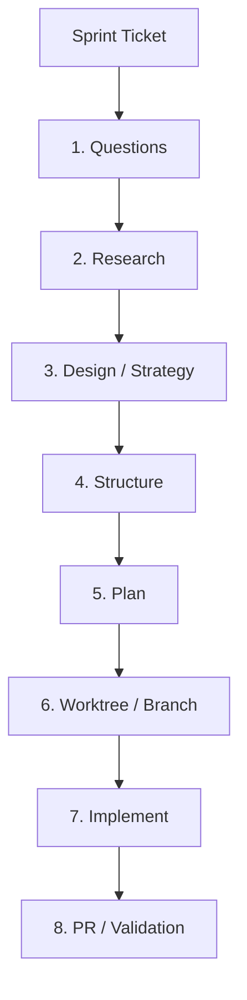

This workflow defines the execution phases to systematically take a ticket from sprint files, align on design constraints using QRSPI, implement code using Test-Driven Development (TDD), and validate code and boundary gates before submitting a PR.

---

## 🧭 Workflow Structure (HumanLayer QRSPI)

QRSPI is an 8-stage framework designed to improve the reliability of AI coding agents by front-loading alignment and keeping the context window clean. Progress and state are persisted in markdown files in `.agents/scratch/`.

---

## 🛠️ Execution Phases

### Stage 1: Questions (Alignment Subagent)
*Goal: Identify ambiguity and raise clarifying questions before writing code or plans.*
1. Read the ticket specifications in the corresponding sprint markdown file (e.g. `docs/sprints/sprint-1.md`).
2. Identify any underspecified requirements, configuration settings, or edge cases.
3. Ask the user/team for clarification. Do not proceed until these requirements are cleared.
4. Output questions and answers to `.agents/scratch/qrspi-questions.md`.

---

### Stage 2: Research (Fact-Gathering Subagent)
*Goal: Gather factual codebase context without forming premature plans or writing code.*
1. Scan the codebase using grep/search and knowledge graph queries to locate related files.
2. Review relevant guidelines:
   - `docs/architecture/target-architecture-with-phases.md`
   - `docs/sprints/general-instructions.md`
   - `.agents/rules/conventions.md`
3. Document existing models, helpers (e.g., `imgutil`, `session`), and highest database migration indexes under `db/migrations/`.
4. Output facts to `.agents/scratch/qrspi-research.md`.

---

### Stage 3: Design / Strategy (Tradeoffs & Architecture Subagent)
*Goal: Formulate the architectural strategy and discuss tradeoffs before planning the tasks.*
1. Map out the vertical slice structure (`internal/<slice>/`).
2. Identify cross-slice boundary relations:
   - Decide how slice interaction will be handled (duck-typed narrow interfaces vs Event Bus mutations).
   - Ensure data references are ID-only.
3. Evaluate database persistence requirements.
4. Present design options, trade-offs, and decisions.
5. Save design notes to `.agents/scratch/qrspi-design.md`.

---

### Stage 4: Structure (Constraints Enforcement Subagent)
*Goal: Define the strict conventions and safety constraints the implementation must satisfy.*
1. Document the exact boundary rules (D5) to be respected.
2. Enforce the DB factory interface requirement: Stores must accept `platform/database.DB` (D4).
3. Outline the SQLite constraints: WAL mode enabled, 5000ms busy timeout, connection pooling limits (MaxOpenConns = 1 in write path).
4. For frontend tickets, document Next.js App Router conventions and F1-F6 constraints (auth cookies, image validation, WebSocket heartbeats, folder mapping).
5. Save the structural constraints checklist to `.agents/scratch/qrspi-structure.md`.

---

### Stage 5: Plan (Execution Plan Subagent)
*Goal: Write an atomic execution checklist with explicit success criteria.*
1. Map out the exact files to be created (`[NEW]`) or modified (`[MODIFY]`).
2. Detail the test plans: table-driven tests for commands/queries, isolated in-memory SQLite store tests for backend. For frontend tickets, plan component-level unit and integration tests using Vitest.
3. For migration tickets, plan Strangler Fig migration sequences explicitly: contract tests first, parallel implementation, route swap, verification, and legacy code deletion.
4. Construct a step-by-step TODO checklist.
5. Save this plan to `.agents/scratch/qrspi-plan.md`.

---

### Stage 6: Worktree / Branch (Environment Setup Subagent)
*Goal: Provision the development branch and prepare the workspace.*
1. Resolve Gitea username: run `cat ~/.config/tea/config.yml | grep 'user:' | head -1 | awk '{print $2}'` to get the correct dev username.
2. Verify resolved username is in known devs: `epapamic`, `ekaramet`, `dkotsi`, `geoikonomou`, `smichail`. If not, flag error.
3. Determine the branch name based on the convention: `<username>/<type>-<detail>` (e.g. `geoikonomou/feat-s1-be-01-db-factory`).
4. Checkout the branch:
   - For Antigravity: `rtk git checkout -b <branch-name>`
   - For OpenCode: `git checkout -b <branch-name>`
5. Confirm clean worktree status (`git status`).

---

### Stage 7: Implement (TDD Implementation Subagent)
*Goal: Implement the planned changes mechanically using TDD, checking off checklist items.*
1. Work sequentially through the plan in `.agents/scratch/qrspi-plan.md`.
2. Follow the TDD loop for every new behavior:
   - **RED**: Write failing tests (Vitest for frontend components/hooks, or Go testing for backend) and verify failure.
   - **GREEN**: Write the minimal code/markup to pass the tests.
   - **REFACTOR**: Tidy up and run lints/formatting (using Biome for frontend, standard formatting for backend).
3. Perform surgical changes: do not fix adjacent formatting or delete pre-existing dead code. Clean up imports/variables orphaned by your changes.
4. Keep the checklist in `.agents/scratch/qrspi-plan.md` updated.

---

### Stage 8: PR / Validation (Validator Subagent)
*Goal: Perform a formal code review and validation of all gates before submitting the PR.*
1. Check the implementation against all gates defined in the structure stage:
   - Run full CI pipeline: `rtk make ci`.
   - Check boundary rules (no cross-slice transport/store imports).
   - Verify branch and conventional commit message styles.
2. Draft a beautiful markdown PR description message using the template from `@.github/PULL_REQUEST_TEMPLATE.md` (including the Audit Checklist Coverage table).
3. Publish the PR via CLI tools (Gitea `tea` CLI).
