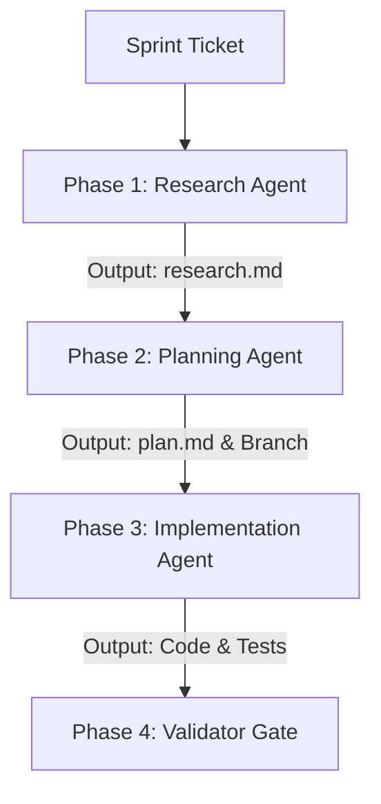

This workflow defines the execution phases to systematically take a ticket from sprint files, design its architecture using Domain-Driven Design (DDD), implement it using Test-Driven Development (TDD), and validate code and boundary gates before submitting a PR.

---

## 🧭 Workflow Structure (HumanLayer RPI)

To prevent cognitive overload (the "Dumb Zone") and ensure high correctness, this workflow divides the implementation lifecycle into three sequential phases with distinct subagent contexts. Progress and state are persisted in markdown files in `.agents/scratch/`.

---

## 🛠️ Execution Phases

### Phase 1: Research (Fact-Gathering Subagent)
*Goal: Gather exact context and identify dependencies. Do not make code edits or compile changes in this phase.*
1. **Locate Ticket**:
   - Locate the target ticket ID in `docs/sprints/ticket-tracker.md` to confirm the sprint and role.
   - Read the exact ticket specifications in the corresponding sprint markdown file (e.g., `docs/sprints/sprint-1.md`).
2. **Scan Codebase**:
   - Query the knowledge graph or search the codebase for related files, structs, or functions.
   - Review architectural files:
     - `docs/architecture/target-architecture-with-phases.md`
     - `docs/sprints/general-instructions.md`
     - `.agents/rules/conventions.md`
3. **Analyze Boundaries**:
   - Trace which slice package (`internal/<slice>`) is affected and what interfaces or dependencies are touched.
4. **Output Factsheet**:
   - Write all facts to `.agents/scratch/research.md` (e.g., locations of relevant code, existing models, or dependencies).

---

### Phase 2: Plan (Architectural & Strategy Planning Subagent)
*Goal: Design the solution and construct an execution checklist. Do not write implementation code.*
1. **Determine Branch Name**:
   - Choose a branch name matching the convention: `<username>/<type>-<detail>` (e.g., `ekaramet/feat-s1-be-01-db-factory` or `arnald/fix-sqlite-busy-timeout`).
2. **Define DDD Strategy**:
   - **Entity Design**: Define the domain structures and database schema updates. Identify if database migration scripts (`db/migrations/00000X_*.sql`) are required.
   - **Interface Separation (D2/D3)**: Determine if the features require sync interfaces or Event Bus pub/sub updates for cross-slice behavior. Ensure cross-slice references use ID-only fields.
   - **Boundary Constraints (D5)**: Ensure transport logic remains isolated in `transport/`, store queries remain in `store/`, and business logic stays in `commands/`/`queries/`.
   - **Strangler Fig sequence (R1)**: For migration tickets, explicitly plan the migration steps: (1) write contract tests against the old API; (2) build the new slice alongside the old; (3) verify contract tests pass on both; (4) swap routing in `bootstrap.go`; (5) monitor; (6) delete old directories.
3. **Formulate Test Plan**:
   - Detail the Go table-driven tests and store/integration test setups (using independent SQLite database instances) for backend, or component-level unit/integration tests in Vitest for frontend.
4. **Output Plan & Checkout Branch**:
   - Write the plan, code draft structures, and task checklist to `.agents/scratch/plan.md`.
   - Create and switch to the target branch:
     - For Antigravity: `rtk git checkout -b <branch-name>`
     - For OpenCode: `git checkout -b <branch-name>`

---

### Phase 3: Implement (TDD Implementation Subagent)
*Goal: Execute the checklist mechanically using Test-Driven Development (TDD). Focus only on the plan.*
1. **TDD Loop**:
   - **RED**: Write failing tests (Vitest for frontend components/hooks, or `*_test.go` for backend commands/queries/stores) and run them to verify failure.
   - **GREEN**: Write the minimal code to satisfy the tests. Ensure database stores accept `platform/database.DB` (D4).
   - **REFACTOR**: Clean up code and test structures. Format code (using Biome for frontend, standard formatting for backend).
2. **Mandatory Frontend Standards Check**:
   - Ensure all implemented features conform to **Mandatory Frontend Standards** (F1 FEATURE-TO-AUDIT requirements: proper form inputs, privacy confirmation dialogs, follow gates, chat emojis, image mime validation, RSC boundaries).
3. **SQLite Rules**:
   - Ensure the SQLite DSN enables WAL mode, sets a busy timeout of 5000, and connection pool limit to 1-10 max open connections (1 open for write operations).
4. **Surgical Scope Check**:
   - Strictly follow the plan. Do not perform adjacent formatting or refactoring. Clean up any imports or variables orphaned by your implementation changes.
5. **Log Progress**:
   - Keep `.agents/scratch/plan.md` updated with completed items.

---

### Phase 4: Validate (Quality Gate Validator Subagent)
*Goal: Check that all architectural, structural, and test gates have been respected.*
1. Run the validator subagent prompts to check all boundary constraints (no cross-slice transport/store imports).
2. Confirm branch names and conventional commit history structure.
3. Run verification commands to ensure all validation gates pass cleanly:
   - Backend: `rtk make ci` or `rtk make test`
   - Frontend (in `frontend/`): `rtk bun run lint && rtk bun run format:check && rtk tsc --noEmit && rtk bun run test`
4. If any gates fail, output error locations and revert to Phase 3.

