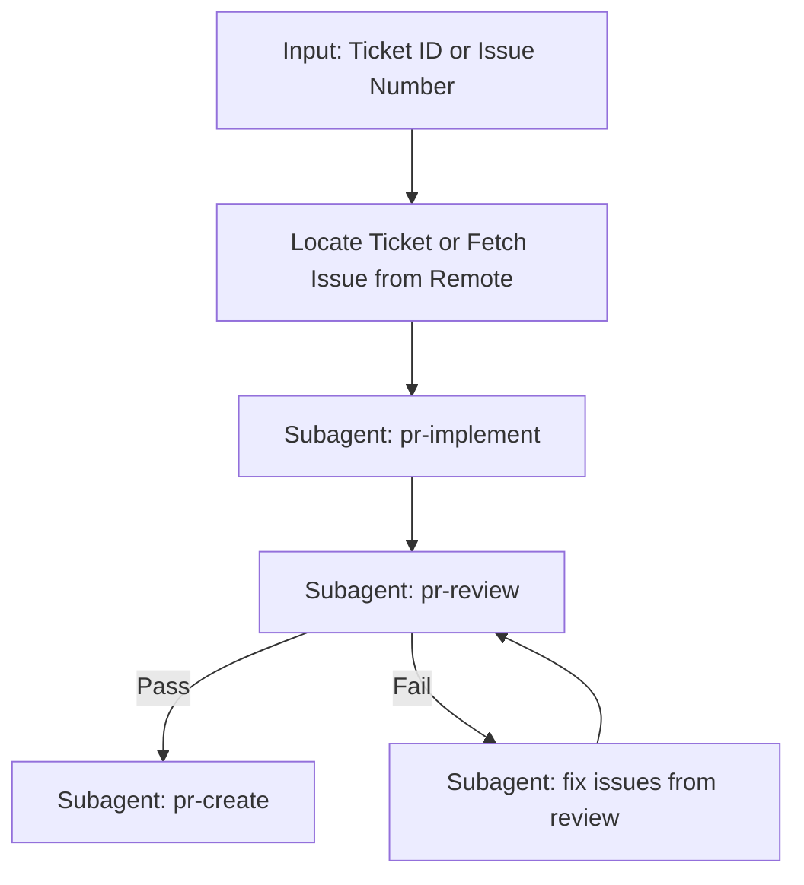

---

## 🧭 Orchestration Flow



---

## 🛠️ Input

Either:
- A ticket ID from `docs/sprints/ticket-tracker.md` (e.g. `S1-BE-05`, `S3-FE-14`).
- An issue ID/number from the repository (e.g. `42`, `#42`).

---

## 🛠️ Execution Phases

### Phase 0: Locate Ticket or Fetch Issue
- **If Input is a Ticket ID (e.g., `S1-BE-05`):**
  1. Search `docs/sprints/ticket-tracker.md` for the target ticket ID.
  2. Determine the sprint number and open the corresponding sprint file (`docs/sprints/sprint-<N>.md`).
  3. Read the ticket's Description, Detailed Steps, and Verification sections.
- **If Input is an Issue ID/Number (e.g., `42` or `#42`):**
  1. Fetch the issue description and title using Gitea CLI: `tea issue <number> --comments=false`.
  2. If discussions or extra context are needed, fetch comments: `tea issue <number>`.
  3. Identify core requirements and any reference code mentioned in the issue.

---

### Phase 1: Implement (pr-implement subagent)
Dispatch a subagent with the command:

```
Follow the workflow in .agents/workflows/pr-implement.md to implement ticket <TICKET_ID> or issue <ISSUE_ID>.
```

This subagent runs the HumanLayer RPI loop (Research → Plan → Implement → Validate) and persists scratch state to `.agents/scratch/`. It creates the branch and writes code+tests.

**Must verify against [conventions.md](../rules/conventions.md):** D2–D5 boundary rules, TDD requirement, SQLite rules, branching/commit format, security best practices, frontend build gates (Biome lint/format, `tsc --noEmit`, Vitest).

**Exit gate:** Implementation complete, branch checked out, code committed.

---

### Phase 2: Review (pr-review subagent)
Dispatch a subagent with the command:

```
Follow the prompt in .agents/prompts/pr-review.md to review the current branch (<branch-name>) against ticket <TICKET_ID> or issue <ISSUE_ID>.
Verify all checks from .agents/rules/conventions.md (D2-D5 boundaries, SQLite, TDD, security, frontend build gates).
Run all deterministic gates (make ci). Perform the full 4-phase review pipeline.
Save the report to docs/reviews/PR_<TICKET_ID_OR_ISSUE_ID>_REVIEW_REPORT.md.
```

**Exit gates:**
- `🟢 APPROVED` — proceed to Phase 4.
- `🟡 PASS WITH RECOMMENDATIONS` — proceed to Phase 3 (fix loop). After 3 total reviews, if still `PASS WITH RECOMMENDATIONS`, treat as acceptable and proceed to Phase 4.
- `🔴 CHANGES REQUESTED` — proceed to Phase 3.

---

### Phase 3: Fix (remediation subagent)
Dispatch a subagent with the command:

```
Read docs/reviews/PR_REVIEW_REPORT.md. Fix every Critical and Warning finding.
Perform surgical edits only — do not touch unrelated code.
After fixes, run the deterministic gates again (make ci).
Commit each fix group with conventional commit messages.
```

After the fix subagent completes, **go back to Phase 2** (re-run review).

**Loop limit:** If review fails 3+ times, stop and report unresolved findings to the user.

---

### Phase 4: Create PR (pr-create subagent)
Dispatch a subagent with the command:

```
Follow the workflow in .agents/workflows/pr-create.md to verify, draft, and publish the PR for branch <branch-name> matching ticket <TICKET_ID> or issue <ISSUE_ID>.
```

This subagent verifies branch/convention rules, drafts the PR description to `.git/PR_DESCRIPTION.md` (including `Closes #<ISSUE_ID>` if referencing an issue), pushes the branch, and publishes the PR via `tea` CLI with all repo collaborators as reviewers.

---

## 🔁 Review-Fix Loop Protocol

| Attempt | Action |
|---------|--------|
| 1st review fail | Dispatch fix subagent, re-run review |
| 2nd review fail | Dispatch fix subagent, re-run review |
| 3rd review fail | Stop. Output the accumulated review report and ask the user for guidance. |

Each fix iteration must:
- Read only the review report to identify issues
- Make surgical edits (scope-locked to findings)
- Re-run deterministic gates locally
- Commit fixes
- Then trigger a fresh review

---

## 📝 Output Artifacts

| Artifact | Location |
|----------|----------|
| Research facts | `.agents/scratch/research.md` |
| Implementation plan | `.agents/scratch/plan.md` |
| Review report | `docs/reviews/PR_<TICKET_ID_OR_ISSUE_ID>_REVIEW_REPORT.md.` |
| PR description | `.git/PR_DESCRIPTION.md` (cleaned up after PR creation) |
