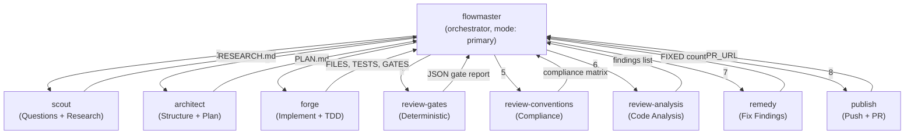

# Context Engineering & Agent Architecture Optimization — v2

> Incorporates suggestions from both enforcement reports + HumanLayer QRSPI research.
> All enforcement runs locally — no GitHub runners required.

---

## Execution Order

| Phase | Part | Effort | Impact |
|-------|------|--------|--------|
| 1 | **Part 1: Context Reduction** | ~1 hour | 80% token savings per agent |
| 2 | **Part 3: Deterministic Gates + Local Hooks** | ~4 hours | Biggest quality + cost ROI |
| 3 | **Part 2: QRSPI-Based Agent Architecture** | ~3 hours | Best context isolation |

---

## Part 1: Context Restructuring (Option C)

### Decision

Restructure `conventions.md` with clear section markers. Each agent's prompt references **specific sections by tag**. Drop `general-instructions.md` and `target-architecture-with-phases.md` from all agent context lists.

### What Changes

#### [MODIFY] [conventions.md](file:///home/ertval/code/zone-modules/social-network/.agents/rules/conventions.md)

Add section tags as HTML comments:

```markdown
<!-- @section:rules-core — D1-D6, security, TDD (needed by all agents) -->
## 1. Stack
## 2. Vertical Slices & Boundaries
## 3. Strangler Fig Migration
## 4. TDD & Go Style
## 5. Database Migrations
## 6. Security
<!-- @section:rules-core:end -->

<!-- @section:rules-fe — Frontend standards (needed by FE agents) -->
## 7. Frontend
<!-- @section:rules-fe:end -->

<!-- @section:rules-ci — CI gates, build commands (needed by gate-running agents) -->
## 8. CI & Verification
<!-- @section:rules-ci:end -->

<!-- @section:rules-git — Branch naming, commits, PRs (needed by publish) -->
## 9. Git & PRs
<!-- @section:rules-git:end -->

<!-- @section:rules-dod — Definition of Done checklist (needed by review agents) -->
## 10. Definition of Done
<!-- @section:rules-dod:end -->
```

#### Agent Context Table

| Agent | Context Files | Sections to Focus |
|-------|--------------|-------------------|
| `scout` | `conventions.md` | `rules-core` |
| `architect` | `conventions.md` | `rules-core` + `rules-ci` |
| `forge` | `conventions.md`, `AGENTS.md` §1-§4 | `rules-core` + `rules-ci` |
| `remedy` | `conventions.md` | `rules-core` |
| `review-gates` | none (runs scripts) | — |
| `review-conventions` | `conventions.md` | ALL sections |
| `review-analysis` | `conventions.md` | `rules-core` |
| `publish` | `conventions.md` | `rules-git` + `rules-dod` |

#### Files Permanently Dropped From Agent Context

| File | Why |
|------|-----|
| `general-instructions.md` | 80% redundant with `conventions.md`. Unique content (Q3 smoke tests, F1 frontend mapping) only needed for manual QA. |
| `target-architecture-with-phases.md` | D5 rules already in `conventions.md` §2. Phases are per-ticket (read on demand by scout). ~7,000 tokens for ~500 tokens of value. |

---

## Part 2: QRSPI-Based Flat Agent Architecture

### Research: HumanLayer QRSPI Framework

HumanLayer's original RPI (Research-Plan-Implement) hit failure modes at scale:
- **Context rot**: research artifacts pollute implementation context
- **Instruction budget overflow**: plans get too long for the implementing agent
- **No alignment checkpoint**: human only sees output, not design decisions

**QRSPI** (Questions, Research, Structure, Plan, Implement) fixes this by:
1. **Complete context isolation** — each phase runs in its own subagent with a fresh context window
2. **Artifact handoff** — each phase produces a markdown file that the next phase reads
3. **Human review gates** — plan is reviewed before implementation starts
4. **Subagents for context protection** — orchestrator only sees prompt + final result, never intermediate noise

### Decision: 3-Agent Research/Plan/Implement Split

The old `forge` (single agent doing R+P+I) becomes **3 completely separate agents**:

| Agent | QRSPI Phase | Input | Output | Context |
|-------|-------------|-------|--------|---------|
| **`scout`** | Questions + Research | Ticket ID, sprint spec | `.agents/scratch/RESEARCH.md` | Reads codebase freely. No code generation. |
| **`architect`** | Structure + Plan | `RESEARCH.md` | `.agents/scratch/PLAN.md` | Reads research + conventions. Produces actionable plan. |
| **`forge`** | Implement | `PLAN.md` | Code + tests + gates | Executes plan. TDD loop. No exploration. |

### Full Agent Topology (10 agents)



All subagents have `task: {"*": deny}`. Only `flowmaster` has `task: {"*": allow}`.

### New/Updated Agent Files

#### [NEW] `.opencode/agents/scout.md`

```yaml
---
description: "QRSPI Questions+Research phase. Reads the ticket spec, scans the codebase for related code, documents findings. No code generation."
mode: subagent
model: opencode/deepseek-v4-flash-free
color: info
steps: 20
temperature: 0.1
permission:
  read: allow
  glob: allow
  grep: allow
  lsp: allow
  edit:
    "*": deny
    ".agents/scratch/*": allow
  bash:
    "*": deny
    cat*: allow
    grep*: allow
    head*: allow
    tail*: allow
    ls*: allow
    "go list": allow
    wc*: allow
  task:
    "*": deny
---

## scout

QRSPI Questions+Research phase. You investigate the ticket and codebase, then produce a structured research document.

## When invoked, you will receive:
- A ticket ID (e.g. `S3-BE-01`)
- The sprint spec content or reference

## Context Files:
- `.agents/rules/conventions.md` — focus on `@section:rules-core` (D1-D6, TDD, security)

## Your job:
1. Read the ticket spec thoroughly. Identify ambiguities — list them as questions.
2. Scan the codebase for related code: existing entities, interfaces, store methods, transport handlers.
3. Identify cross-slice dependencies the ticket will need (which features does it touch?).
4. Document findings to `.agents/scratch/RESEARCH.md` using this structure:

```markdown
# Research: <TICKET_ID>

## Questions (ambiguities/clarifications needed)
- ...

## Existing Code (files, functions, interfaces relevant to this ticket)
- ...

## Cross-Slice Dependencies
- ...

## Migration Notes (if migrating from old code)
- Old location: ...
- New location: ...
- Contract test needed: yes/no

## Key Constraints (from conventions.md)
- ...
```

5. Do NOT generate any code. Do NOT create branches. Do NOT modify source files.

## Return Format:
```
RESEARCH: .agents/scratch/RESEARCH.md
QUESTIONS: <count of ambiguities found>
RELATED_FILES: <count of existing files identified>
CROSS_SLICE_DEPS: <list of feature slices touched>
```

#### [NEW] `.opencode/agents/architect.md`

```yaml
---
description: "QRSPI Structure+Plan phase. Reads research output and designs the implementation plan with file checklist, TDD strategy, and phase boundaries."
mode: subagent
model: opencode/deepseek-v4-flash-free
color: info
steps: 15
temperature: 0.1
permission:
  read: allow
  glob: allow
  grep: allow
  lsp: allow
  edit:
    "*": deny
    ".agents/scratch/*": allow
  bash:
    "*": deny
    cat*: allow
    grep*: allow
    head*: allow
    tail*: allow
    ls*: allow
  task:
    "*": deny
---

## architect

QRSPI Structure+Plan phase. You read the research and design an actionable implementation plan.

## When invoked, you will receive:
- The ticket ID
- Path to `.agents/scratch/RESEARCH.md`

## Context Files:
- `.agents/rules/conventions.md` — focus on `@section:rules-core` + `@section:rules-ci`
- `.agents/scratch/RESEARCH.md` — the scout's output

## Your job:
1. Read `RESEARCH.md` thoroughly.
2. Design the implementation strategy following D1 vertical slice layout.
3. Create `.agents/scratch/PLAN.md` with this structure:

```markdown
# Plan: <TICKET_ID>

## Branch Name
`<username>/<ticket-ID>-<detail>`

## Files to Create/Modify
- [ ] `internal/<feature>/<feature>.go` — entities + repository interface
- [ ] `internal/<feature>/commands/<use_case>.go` — command handler
- [ ] `internal/<feature>/commands/<use_case>_test.go` — tests (write FIRST)
- [ ] ...

## TDD Sequence (Red → Green → Refactor)
1. Write failing test for <use_case_1>
2. Implement minimal code to pass
3. Write failing test for <use_case_2>
4. ...

## Cross-Slice Interfaces (D2)
- Define `<InterfaceName>` in `commands/<use_case>.go` (consumer-defined, narrow)

## Store Methods (with `// Used by:` comments)
- `<MethodName>` — Used by: <Command/Query>

## Conventional Commits
- `feat(<scope>): <description>`
- `test(<scope>): <description>`

## Validation
- `make ci` must pass after each commit group
```

4. Do NOT generate any code. Do NOT create branches.

## Return Format:
```
PLAN: .agents/scratch/PLAN.md
FILES_PLANNED: <count>
TESTS_PLANNED: <count>
PHASES: <count of TDD phases>
```

#### [MODIFY] `.opencode/agents/forge.md`

Updated to read `PLAN.md` instead of doing research. Implementation only.

```yaml
---
description: "QRSPI Implement phase. Executes the approved plan using TDD. Creates branch, writes tests first, then minimal code."
mode: subagent
model: opencode/deepseek-v4-flash-free
color: success
steps: 45
temperature: 0.1
permission:
  read: allow
  glob: allow
  grep: allow
  lsp: allow
  edit: allow
  bash:
    "*": deny
    git*: allow
    make*: allow
    "go test": allow
    "go vet": allow
    "go build": allow
    "go mod": allow
    golangci-lint*: allow
    bun*: allow
    "tsc *": allow
    cat*: allow
    grep*: allow
    mkdir*: allow
    ls*: allow
  task:
    "*": deny
```
---

## forge

QRSPI Implement phase. You execute the plan using strict TDD.

## When invoked, you will receive:
- The ticket ID and branch name
- Path to `.agents/scratch/PLAN.md`

## Context Files:
- `.agents/rules/conventions.md` — focus on `@section:rules-core` + `@section:rules-ci`
- `AGENTS.md` — §1-§4 only (Think, Simplicity, Surgical, Goal-Driven)
- `.agents/scratch/PLAN.md` — the architect's plan

## Your job:
1. Read `PLAN.md`. Create the branch.
2. Follow the TDD sequence exactly as planned. For each phase:
   a. Write the failing test FIRST
   b. Write minimal code to pass
   c. Run `go test -race ./...`
   d. Commit with conventional commit message
3. After all phases, run `make ci`. Fix any failures.
4. Mark each item in PLAN.md as done (change `- [ ]` to `- [x]`).
5. Remove any imports/variables/functions YOUR changes made unused.

## Constraints:
- Do NOT deviate from the plan. If the plan is wrong, report it — do not improvise.
- Surgical changes only — do not touch unrelated code.
- Do NOT push. Do NOT create PR.

## Return Format:
```
BRANCH: <branch-name>
FILES_CHANGED: <count>
TESTS_ADDED: <count>
GATES: <PASS|FAIL>
PLAN_ITEMS: <completed>/<total>
SUMMARY: <2-4 sentences>
```

#### [MODIFY] `.opencode/agents/flowmaster.md` — Updated QRSPI Orchestration

## Core Loop (QRSPI + Review + Fix + Publish)

1. Locate ticket in `docs/sprints/ticket-tracker.md`, read sprint spec.

Implementation (QRSPI):
2. Spawn scout → receives RESEARCH.md (questions, related code, constraints)
   - If scout returns QUESTIONS > 0, present them to user. Wait for answers.
3. Spawn architect → receives PLAN.md (file checklist, TDD sequence, commits)
   - Present plan to user for review. Wait for approval.
4. Spawn forge → receives FILES_CHANGED, TESTS_ADDED, GATES

Review loop (max 3 cycles):
5. Spawn review-gates → receives JSON gate results
   - If gates FAIL → spawn remedy → loop to step 5
6. Spawn review-conventions → receives compliance matrix
7. Spawn review-analysis → receives findings list
8. Synthesize report into docs/reviews/PR_<TICKET_ID>_REVIEW_REPORT.md
   - If CHANGES REQUESTED → spawn remedy → loop to step 5
   - If PASS WITH RECOMMENDATIONS after 3 cycles → proceed

9. Spawn publish → receives PR_URL

---

## Part 3: Deterministic Gates + Local Enforcement

### Insights From Both Reports

The reports converge on a **4-tier shift-left pipeline**:

```
┌─────────────────────────────────────────────────┐
│ L0: Local Pre-commit/Pre-push (Lefthook)        │ ← instant, file-specific
│ L1: Deterministic Gates (scripts/gates/)        │ ← blocking, PR-time
│ L2: Linter Ecosystem (golangci-lint + go-arch)  │ ← blocking, make ci
│ L3: LLM Semantic Review (agent subagents)       │ ← advisory, deep reasoning
└─────────────────────────────────────────────────┘
```

**All runs locally. No GitHub runners needed.**

### L0: Lefthook Git Hooks (NEW — from Antigravity report §7)

> [!IMPORTANT]
> Lefthook replaces the manual pre-commit/pre-push hooks mentioned in conventions.md §7. It's a Go binary — zero runtime dependencies, parallel execution, sub-second startup.

#### [NEW] `lefthook.yml`

```yaml
# lefthook.yml
pre-commit:
  parallel: true
  jobs:
    - name: go-format
      glob: "*.go"
      run: gofumpt -l {staged_files} | xargs -r gofumpt -w && goimports -w -local social-network {staged_files}
      stage_fixed: true
    - name: go-vet
      run: go vet ./...

pre-push:
  parallel: true
  jobs:
    - name: go-test
      run: go test -short ./...
    - name: go-build
      run: go build ./...
    - name: arch-lint
      run: go-arch-lint check
```

#### Setup commands:
```bash
go install github.com/evilmartians/lefthook/v2@latest
lefthook install
```

### L1: Gate Scripts (Enhanced — from opencode report's 14-gate taxonomy)

The opencode report identified 14 gate categories. We implement 10 as scripts (the other 4 are LLM-only).

#### [NEW] `scripts/gates/` — Full Listing

```
scripts/gates/
├── run-all.sh              # Master runner, outputs JSON
├── check-stack.sh          # Go version, module path (gate #1)
├── check-d1-layout.sh      # Vertical slice structure (gate #2) ← NEW from report
├── check-d5-boundaries.sh  # Import violations via grep (gate #3)
├── check-d6-dag.sh         # Dependency DAG acyclicity (gate #4) ← NEW from report
├── check-tdd.sh            # Test file existence (gate #6)
├── check-migrations.sh     # Sequential naming, up/down pairs, delimiter (gate #7)
├── check-security.sh       # bcrypt cost, SQLi patterns, WS origin (gate #8)
├── check-branch.sh         # Branch naming + conventional commits (gate #9)
├── check-scope-drift.sh    # Only ticket-related files changed
└── check-coverage-delta.sh # Test coverage regression (gate #13) ← NEW from report
```

##### [NEW] `scripts/gates/check-d1-layout.sh` (from opencode report gate #2)

Validates that new/modified feature slices follow the D1 vertical slice layout.

```bash
#!/usr/bin/env bash
# For each feature directory under internal/, verify D1 structure
ERRORS=""
for feature_dir in internal/*/; do
  feature=$(basename "$feature_dir")
  # Skip non-feature dirs
  case "$feature" in core|platform|pkg|config|bootstrap) continue ;; esac
  
  # Check required structure
  [ -f "${feature_dir}${feature}.go" ] || ERRORS="$ERRORS\n${feature_dir}: missing ${feature}.go (entity + repository interface)"
  [ -d "${feature_dir}commands" ] || ERRORS="$ERRORS\n${feature_dir}: missing commands/ directory"
  [ -d "${feature_dir}queries" ] || ERRORS="$ERRORS\n${feature_dir}: missing queries/ directory"
  [ -d "${feature_dir}transport" ] || ERRORS="$ERRORS\n${feature_dir}: missing transport/ directory"
  [ -d "${feature_dir}store" ] || ERRORS="$ERRORS\n${feature_dir}: missing store/ directory"
done

if [ -n "$ERRORS" ]; then
  echo -e "FAIL: D1 layout violations:$ERRORS"
  exit 1
fi
echo "PASS"
```

##### [NEW] `scripts/gates/check-d6-dag.sh` (from opencode report gate #4)

Validates the dependency DAG is acyclic using `go list`.

```bash
#!/usr/bin/env bash
# Use go list to check for circular dependencies between feature slices
FEATURES=$(ls -d internal/*/ 2>/dev/null | xargs -I{} basename {} | grep -v -E '^(core|platform|pkg|config|bootstrap)$')
ERRORS=""

for feature in $FEATURES; do
  DEPS=$(go list -f '{{join .Imports "\n"}}' "social-network/internal/$feature/..." 2>/dev/null | \
    grep "^social-network/internal/" | \
    sed 's|social-network/internal/||' | \
    cut -d/ -f1 | \
    sort -u | \
    grep -v "^$feature$" | \
    grep -v -E '^(core|platform|pkg|config|bootstrap)$')
  
  for dep in $DEPS; do
    # Check if dep also imports feature (cycle)
    REVERSE=$(go list -f '{{join .Imports "\n"}}' "social-network/internal/$dep/..." 2>/dev/null | \
      grep "social-network/internal/$feature" || true)
    [ -n "$REVERSE" ] && ERRORS="$ERRORS\nCIRCULAR: $feature ↔ $dep"
  done
done

# Check notification is never imported
NOTIF_IMPORTERS=$(grep -rn "social-network/internal/notification" internal/ --include="*.go" | \
  grep -v "internal/notification/" | grep -v "internal/bootstrap/" || true)
[ -n "$NOTIF_IMPORTERS" ] && ERRORS="$ERRORS\nD6: notification imported by:\n$NOTIF_IMPORTERS"

if [ -n "$ERRORS" ]; then
  echo -e "FAIL:$ERRORS"
  exit 1
fi
echo "PASS"
```

##### [NEW] `scripts/gates/check-coverage-delta.sh` (from opencode report gate #13)

```bash
#!/usr/bin/env bash
# Compare test coverage between main and current branch
MAIN_COV=$(git stash -q 2>/dev/null; git checkout main -q 2>/dev/null && \
  go test -coverprofile=/tmp/main.cov ./... 2>/dev/null && \
  go tool cover -func=/tmp/main.cov | tail -1 | awk '{print $3}' | tr -d '%'; \
  git checkout - -q 2>/dev/null; git stash pop -q 2>/dev/null)

BRANCH_COV=$(go test -coverprofile=/tmp/branch.cov ./... 2>/dev/null && \
  go tool cover -func=/tmp/branch.cov | tail -1 | awk '{print $3}' | tr -d '%')

if [ -z "$MAIN_COV" ] || [ -z "$BRANCH_COV" ]; then
  echo "PASS: Could not compute coverage delta (no baseline)"
  exit 0
fi

DELTA=$(echo "$BRANCH_COV - $MAIN_COV" | bc)
if (( $(echo "$DELTA < -5" | bc -l) )); then
  echo "FAIL: Coverage dropped by ${DELTA}% (${MAIN_COV}% → ${BRANCH_COV}%)"
  exit 1
fi
echo "PASS: Coverage ${BRANCH_COV}% (delta: ${DELTA}%)"
```

### L2: go-arch-lint + Enhanced depguard (from both reports)

Both reports recommend `go-arch-lint` for YAML-based architectural boundary enforcement.

#### [NEW] `.go-arch-lint.yml`

```yaml
version: 3
workdir: internal

components:
  # Feature slices
  user_slice:         { in: user/** }
  follow_slice:       { in: follow/** }
  topic_slice:        { in: topic/** }
  comment_slice:      { in: comment/** }
  group_slice:        { in: group/** }
  event_slice:        { in: event/** }
  chat_slice:         { in: chat/** }
  notification_slice: { in: notification/** }
  oauth_slice:        { in: oauth/** }
  
  # Cross-cutting
  core:      { in: core/** }
  platform:  { in: platform/** }
  pkg:       { in: pkg/** }
  bootstrap: { in: bootstrap/** }
  config:    { in: config/** }

deps:
  # D6 dependency DAG
  user_slice:         { mayDependOn: [core, platform, pkg] }
  follow_slice:       { mayDependOn: [core, platform, pkg] }
  topic_slice:        { mayDependOn: [core, platform, pkg] }
  comment_slice:      { mayDependOn: [core, platform, pkg] }
  group_slice:        { mayDependOn: [core, platform, pkg] }
  event_slice:        { mayDependOn: [core, platform, pkg] }
  chat_slice:         { mayDependOn: [core, platform, pkg] }
  notification_slice: { mayDependOn: [core, platform, pkg] }
  oauth_slice:        { mayDependOn: [core, platform, pkg] }
  
  # Shared layers
  core:      { mayDependOn: [platform, pkg] }
  platform:  { mayDependOn: [pkg] }
  pkg:       { mayDependOn: [] }
  config:    { mayDependOn: [] }
  bootstrap: { anyVendorDeps: true } # composition root imports everything
```

#### [MODIFY] `.golangci.yml` — Add D5 depguard rules

Add alongside existing `domain_boundary` and `pkg_boundary`:

```yaml
    # D5 Vertical Slice Boundary Rules
    d5_commands_queries:
      files:
        - "internal/*/commands/**"
        - "internal/*/queries/**"
      deny:
        - pkg: "social-network/internal/*/transport"
          desc: "D5: commands/queries must not import transport"
        - pkg: "social-network/internal/*/store"
          desc: "D5: commands/queries must not import store"

    d5_transport:
      files:
        - "internal/*/transport/**"
      deny:
        - pkg: "social-network/internal/*/store"
          desc: "D5: transport must not import store"

    d5_store:
      files:
        - "internal/*/store/**"
      deny:
        - pkg: "social-network/internal/*/transport"
          desc: "D5: store must not import transport"
        - pkg: "social-network/internal/*/commands"
          desc: "D5: store must not import commands"
        - pkg: "social-network/internal/*/queries"
          desc: "D5: store must not import queries"
```

#### [MODIFY] `Makefile` — New Targets

```makefile
check-arch: ## Run go-arch-lint architectural boundary check
	@echo "==> Running go-arch-lint..."
	go-arch-lint check

review-gates: ## Run all deterministic review gates
	@echo "==> Running review gates..."
	@bash scripts/gates/run-all.sh

setup-hooks: ## Install Lefthook git hooks
	@echo "==> Installing Lefthook hooks..."
	go install github.com/evilmartians/lefthook/v2@latest
	lefthook install

setup-arch-lint: ## Install go-arch-lint
	@echo "==> Installing go-arch-lint..."
	go install github.com/fe3dback/go-arch-lint@latest
```

### What the LLM Still Does (L3 — Cannot Be Automated)

| Check | Why LLM Required |
|-------|-----------------|
| Cross-slice SQL joins | Requires knowing which tables belong to which feature |
| Infrastructure patterns (healthz, shutdown) | Requires understanding code intent |
| Logic correctness (races, leaks) | Requires reasoning about program flow |
| Architecture intent violations | Code passes D5 but violates the spirit |
| Missing edge cases, test gaps | Judgement call |

---

## Summary of All File Changes

### New Files (14)

| File | Purpose |
|------|---------|
| `.opencode/agents/scout.md` | QRSPI Questions+Research agent |
| `.opencode/agents/architect.md` | QRSPI Structure+Plan agent |
| `.opencode/agents/review-gates.md` | Deterministic gate runner |
| `.opencode/agents/review-conventions.md` | Convention compliance checker |
| `.opencode/agents/review-analysis.md` | Deep code analysis |
| `.go-arch-lint.yml` | Architectural boundary rules |
| `lefthook.yml` | Local git hook configuration |
| `scripts/gates/run-all.sh` | Master gate runner |
| `scripts/gates/check-stack.sh` | Go version, module path |
| `scripts/gates/check-d1-layout.sh` | Vertical slice structure |
| `scripts/gates/check-d6-dag.sh` | Dependency DAG acyclicity |
| `scripts/gates/check-{branch,migrations,scope-drift,tdd,security}.sh` | Individual gates (5 files) |
| `scripts/gates/check-coverage-delta.sh` | Test coverage regression |

### Modified Files (5)

| File | Change |
|------|--------|
| `.agents/rules/conventions.md` | Add section tags |
| `.opencode/agents/forge.md` | Now reads PLAN.md, implement-only |
| `.opencode/agents/flowmaster.md` | QRSPI orchestration with 9 subagents |
| `.golangci.yml` | Add D5 depguard rules |
| `Makefile` | Add `check-arch`, `review-gates`, `setup-hooks`, `setup-arch-lint` targets |

### Agents Renamed (existing)

| Old Name | New Name |
|----------|----------|
| `pr-implement` | `forge` |
| `pr-review` | `audit` (deleted — replaced by 3 review agents) |
| `pr-fix` | `remedy` |
| `pr-create` | `publish` |
| `ticket-to-pr` | `flowmaster` |

### Final Agent Roster (10)

| Agent | Role | Steps | Mode |
|-------|------|-------|------|
| `flowmaster` | QRSPI orchestrator | 80 | primary |
| `scout` | Questions + Research | 20 | subagent |
| `architect` | Structure + Plan | 15 | subagent |
| `forge` | Implement (TDD) | 45 | subagent |
| `review-gates` | Deterministic gates | 10 | subagent |
| `review-conventions` | Convention compliance | 20 | subagent |
| `review-analysis` | Code analysis | 25 | subagent |
| `remedy` | Fix findings | 35 | subagent |
| `publish` | Push + PR creation | 30 | subagent |

---

## Verification Plan

### Part 1 Verification
- Edit `conventions.md` with section tags
- Update agent `.md` context lists
- Run flowmaster on a test ticket — verify no quality regression

### Part 3 Verification
- Install Lefthook: `make setup-hooks` → verify hooks trigger on commit
- Install go-arch-lint: `make setup-arch-lint` → run `make check-arch`
- Add depguard rules → run `golangci-lint run` → verify D5 violations caught
- Run each gate script individually → verify expected PASS/FAIL
- Run `make review-gates` → verify combined JSON output
- Introduce deliberate violation → confirm gate failure

### Part 2 Verification
- Create `scout.md`, `architect.md` agent files
- Update `forge.md` to implement-only mode
- Update `flowmaster.md` with QRSPI orchestration
- Dry-run: `flowmaster` on a test ticket → verify:
  - scout produces RESEARCH.md
  - architect produces PLAN.md from RESEARCH.md
  - forge executes PLAN.md without research
  - Review agents run independently with fresh context
