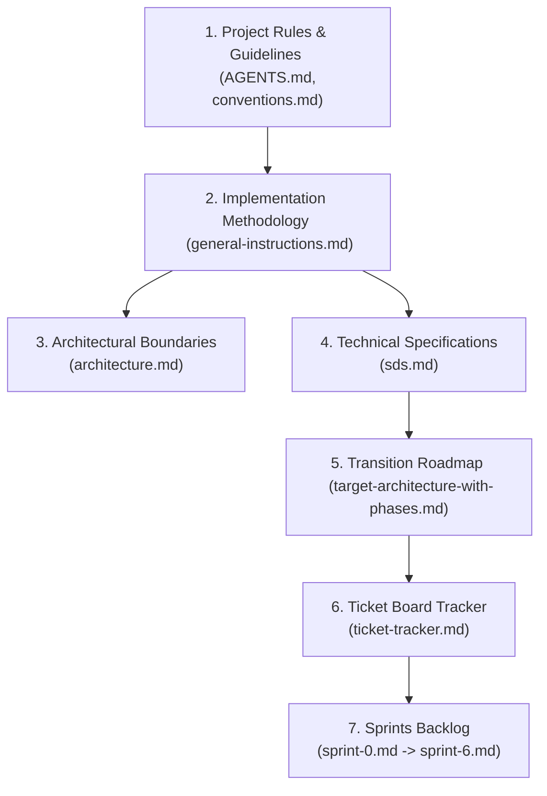

# AGENTS.md

**Tradeoff:** These guidelines bias toward caution over speed. For trivial tasks, use judgment.

## 1. Think Before Coding

**Don't assume. Don't hide confusion. Surface tradeoffs.**

Before implementing:
- State your assumptions explicitly. If uncertain, ask.
- If multiple interpretations exist, present them - don't pick silently.
- If a simpler approach exists, say so. Push back when warranted.
- If something is unclear, stop. Name what's confusing. Ask.

## 2. Simplicity First

**Minimum code that solves the problem. Nothing speculative.**

- No features beyond what was asked.
- No abstractions for single-use code.
- No "flexibility" or "configurability" that wasn't requested.
- No error handling for impossible scenarios.
- If you write 200 lines and it could be 50, rewrite it.

Ask yourself: "Would a senior engineer say this is overcomplicated?" If yes, simplify.

## 3. Surgical Changes

**Touch only what you must. Clean up only your own mess.**

When editing existing code:
- Don't "improve" adjacent code, comments, or formatting.
- Don't refactor things that aren't broken.
- Match existing style, even if you'd do it differently.
- If you notice unrelated dead code, mention it - don't delete it.

When your changes create orphans:
- Remove imports/variables/functions that YOUR changes made unused.
- Don't remove pre-existing dead code unless asked.

The test: Every changed line should trace directly to the user's request.

## 4. Goal-Driven Execution

**Define success criteria. Loop until verified.**

Transform tasks into verifiable goals:
- "Add validation" → "Write tests for invalid inputs, then make them pass"
- "Fix the bug" → "Write a test that reproduces it, then make it pass"
- "Refactor X" → "Ensure tests pass before and after"

For multi-step tasks, state a brief plan:
```
1. [Step] → verify: [check]
2. [Step] → verify: [check]
3. [Step] → verify: [check]
```

Strong success criteria let you loop independently. Weak criteria ("make it work") require constant clarification.

## 5. Progressive Disclosure — Doc Reading Order

`architecture.md` and `sds.md` describe the **target** vertical-slice state, not the current codebase (which is layered hex). Read in this order to avoid confusion:



- **Stage 1: Rules and Guidelines**: Read [AGENTS.md](AGENTS.md) and [.agents/rules/conventions.md](.agents/rules/conventions.md).
- **Stage 2: Methodology & Strangler Fig Strategy**: Read [docs/sprints/general-instructions.md](docs/sprints/general-instructions.md) to understand TDD, Strangler Fig phases, and verification gates.
- **Stage 3: Architecture Definition**: Read [docs/architecture/architecture.md](docs/architecture/architecture.md) for the vertical slice code layout structure.
- **Stage 4: System Design and DDL Specs**: Read [docs/architecture/sds.md](docs/architecture/sds.md) to inspect the data model, interfaces, and platform services.
- **Stage 5: Execution Roadmaps**: Read [docs/architecture/target-architecture-with-phases.md](docs/architecture/target-architecture-with-phases.md) (migration roadmap, target state, design decisions D1-D6) and [docs/sprints/ticket-tracker.md](docs/sprints/ticket-tracker.md) (all sprint tickets at a glance).
- **Stage 6: Sprint Implementation Slices**: Sprints [sprint-0.md](docs/sprints/sprint-0.md), [sprint-1.md](docs/sprints/sprint-1.md), [sprint-2.md](docs/sprints/sprint-2.md), [sprint-3.md](docs/sprints/sprint-3.md), [sprint-4.md](docs/sprints/sprint-4.md), [sprint-5.md](docs/sprints/sprint-5.md), and [sprint-6.md](docs/sprints/sprint-6.md).
- **Stage 7: Verification**: Read [docs/requirements/audit.md](docs/requirements/audit.md) and [docs/requirements/readme.md](docs/requirements/readme.md) for grading acceptance criteria.


## 6. Documentation Conventions

- **Use relative paths** in all plans, proposals, and documentation — never absolute/full file paths.
  - ✅ `internal/user/service.go`, `docs/plan/arch-proposals.md`
  - ❌ `/home/user/code/social-network/internal/user/service.go`
- Reference paths from the project root (where `go.mod` lives).

## 7. Git Branch Naming

All branches must follow the format `<username>/<type>-<detail>`.

- **username**: Your own Gitea username — known devs: `epapamic`, `ekaramet`, `dkotsi`, `geoikonomou`, `smichail`. Use your own (e.g. `ekaramet/...`), not the `origin` remote owner.
- **Username Resolution**: Run `cat ~/.config/tea/config.yml | grep 'user:' | head -1 | awk '{print $2}'` to get the correct Gitea username. This is the `user` field from the default tea login.
- **Username Verification**: After resolving, confirm the username is in the known devs set (`epapamic`, `ekaramet`, `dkotsi`, `geoikonomou`, `smichail`). If not, flag error — branch will fail PR validation.
- **type**: Short category — `feat`, `fix`, `chore`, `refactor`, `docs`, `arch`
- **detail**: kebab-case description of the change. Ticket ID (e.g. `S3-fix-`) may prefix type for traceability, but is not required.

Examples:
- `ekaramet/feat-arch-proposal`
- `dkotsi/fix-sqlite-busy-timeout`
- `geoikonomou/chore-update-deps`

## graphify

This project has a knowledge graph at graphify-out/ with god nodes, community structure, and cross-file relationships.

When the user types `/graphify`, invoke the `skill` tool with `skill: "graphify"` before doing anything else.

Rules:
- For codebase questions, first run `graphify query "<question>"` when graphify-out/graph.json exists. Use `graphify path "<A>" "<B>"` for relationships and `graphify explain "<concept>"` for focused concepts. These return a scoped subgraph, usually much smaller than GRAPH_REPORT.md or raw grep output.
- Dirty graphify-out/ files are expected after hooks or incremental updates; dirty graph files are not a reason to skip graphify. Only skip graphify if the task is about stale or incorrect graph output, or the user explicitly says not to use it.
- If graphify-out/wiki/index.md exists, use it for broad navigation instead of raw source browsing.
- Read graphify-out/GRAPH_REPORT.md only for broad architecture review or when query/path/explain do not surface enough context.
- After modifying code, run `graphify update .` to keep the graph current (AST-only, no API cost).
