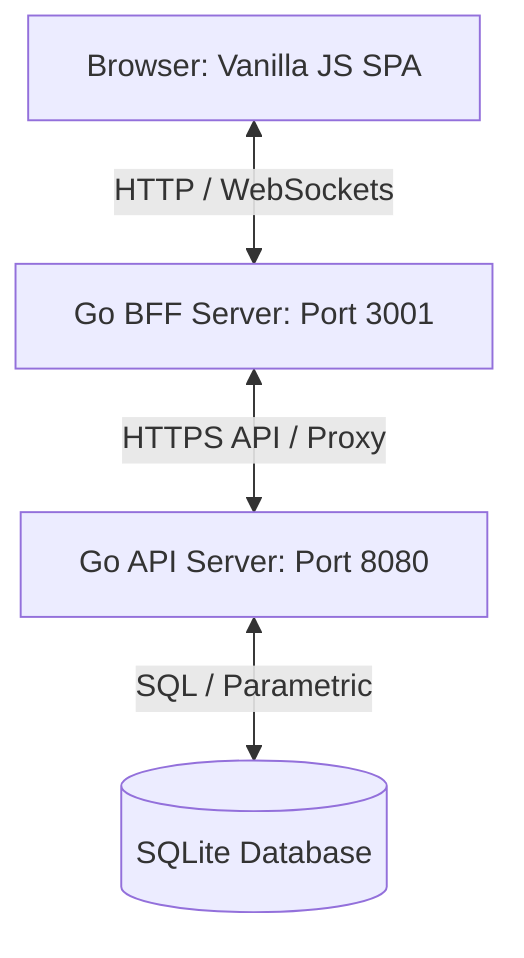

# 🌐 Social Network - Clean Architecture SPA

A premium, high-performance social networking platform built with a **Go backend API server**, a **Go Backend-for-Frontend (BFF) proxy**, and a **custom client-side Vanilla JavaScript Single-Page Application (SPA)**. 

The project employs **Clean Architecture** principles to enforce strict separation of concerns, SQLite WAL mode for concurrency, secure WebSocket handshakes, and a responsive glassmorphic user interface.

---

## 🏗️ System Architecture

The project is structured according to **Clean Architecture** and the **BFF (Backend-For-Frontend)** pattern.



### 1. Layers Overview
*   **Domain Layer (`internal/domain/`)**: Pure business models (User, Post, Group, Comment, Chat, Notification, Vote) and repository interfaces. Contains no external dependencies and enforces high-level domain rules.
*   **Application Layer (`internal/app/`)**: Core application logic using the **CQRS (Command Query Responsibility Segregation)** pattern. Orchestrates use cases by linking domain objects to infrastructure contracts.
*   **Infrastructure Layer (`internal/infra/`)**: External concerns including the SQL schema, SQLite drivers, HTTP handlers, Gorilla WebSocket hub, and rate-limiting.

### 2. The BFF Pattern
To safeguard session tokens and streamline API requests, the client browser interacts with the **BFF Server (`cmd/client`)**. The BFF:
1. Serves the static HTML/JS/CSS assets.
2. Intercepts outgoing requests to route them securely to the downstream **API Server (`cmd/server`)**.
3. Manages cookie-based session state (`access_token` and `refresh_token` rotation) behind `HTTPOnly` and secure flags.

---

## 🌟 Core Features (Finished Product Specification)

### 🔐 Authentication & Session Persistence
*   **Comprehensive Registration**: Supports registering via Email, Password, First Name, Last Name, Date of Birth (date format), Avatar (optional), Nickname (optional), and About Me (optional).
*   **Secure Sessions**: Employs double-cookie authentication (`access_token` + `refresh_token`) with automatic sliding-window rotation and secure database storage.
*   **OAuth Integration**: Extends login functionality to **GitHub** and **Google** authorization providers via unified OAuth handler pipelines.

### 👥 Followers & Profile Privacy
*   **Granular Profile Privacy**: Profiles can be toggled between **Public** and **Private** status.
    *   *Public*: Profile information, activity history, and follower list are visible to all users. Following requests are automatically accepted.
    *   *Private*: Profile metadata and posts are restricted. Non-followers must send a follow request.
*   **Follow Request Lifecycle**: Real-time notifications allow recipients to **Accept** or **Decline** incoming follow requests.

### 📝 Posts, Comments & Privacy Scopes
*   **Media Support**: Users can attach JPEG, PNG, and GIF images (validated via magic bytes to prevent MIME-spoofing).
*   **Custom Privacy Scopes**: Each post can be individually scoped:
    *   `public`: Visible to everyone on the network.
    *   `almost private`: Restrained to current followers.
    *   `private`: Restricted to a custom list of selected followers.

### 💬 Real-Time Unified Chat Room & Direct Messages
*   **Gorilla WebSockets**: Real-time message exchanges with token-based handshake validation.
*   **Follower Validation**: Chat initialization verifies that at least one of the two users follows the other.
*   **Modern Chat Features**: Support for emojis, active typing indicators, live presence indicators, and message-read status indicators.
*   **Group Chat Rooms**: Automatically provisioned chat rooms for every Group, accessible to all verified members.

### 🏛️ Groups & Events
*   **Group Lifecycle**: Create groups with descriptions, invite users, or request membership. Group owners manage member requests (approve/deny), while invited users accept invitations.
*   **Browse and Search**: Dedicated group index pages allow users to find and request to join communities.
*   **Group Events**: Members can schedule events with a Title, Description, Date/Time, and RSVP trackers (**Going** vs **Not Going**).

### 🔔 Live Notifications
*   **Unified Notification Stream**: Pushed via Server-Sent Events (SSE) or WebSockets.
*   **Triggers**:
    *   `follow-request`: Sent when a user requests to follow a private profile.
    *   `group-invite`: Invitation to join a group.
    *   `group-join`: Join request sent to a group creator.
    *   `event-creation`: Event posted inside a joined group.

---

## 🛠️ Technology Stack

*   **Backend**: Go (v1.24+), Gorilla WebSockets, Bcrypt (`golang.org/x/crypto/bcrypt`).
*   **Database**: SQLite3 with WAL (Write-Ahead Logging) enabled (`_journal_mode=WAL`) and high-concurrency timeout (`_busy_timeout=5000`).
*   **Frontend**: Vanilla HTML5/CSS3 (Glassmorphic dark-theme, responsive layouts) and Vanilla JavaScript.
*   **Orchestration**: Docker & Docker-Compose.

---

## 🚀 Getting Started

### 📋 Prerequisites
*   Docker (v20+) and Docker-Compose (v2+)
*   Go (v1.24+ if running locally)

---

### 🐳 Running via Docker (Recommended)

The project leverages a multi-stage Docker build that bundles the Go binaries and assets into a single secure runtime image.

#### 1. Setup Environment Configuration
Create a `.env` file in the root directory or configure environment variables in `docker-compose.yml`. For OAuth capabilities, fill in the provider credentials:
```env
SERVER_PORT=8080
CLIENT_PORT=3001
DB_SEED_ON_START=true
SESSION_SECURE_COOKIE=false
GITHUB_CLIENT_ID=your_github_id
GITHUB_CLIENT_SECRET=your_github_secret
GOOGLE_CLIENT_ID=your_google_id
GOOGLE_CLIENT_SECRET=your_google_secret
```

#### 2. Start Services
Build and launch the containers in the background:
```bash
make docker-up
```

For interactive development mode (binds code mounts and loads seed data):
```bash
make docker-dev
```

#### 3. Access the Application
*   **Frontend SPA**: [http://localhost:3001](http://localhost:3001)
*   **Backend API**: [http://localhost:8080/api/v1](http://localhost:8080/api/v1)

#### 4. Stop Services
```bash
make docker-down
```
To purge persistent volumes and SQLite databases:
```bash
make docker-clean
```

---

### 💻 Running Locally (Without Docker)

You can run the application directly on your host machine for debugging.

#### 1. Generate SSL Certificates (Optional for HTTPS)
```bash
# If using TLS, generate localhost certificates
bash makecerts.sh
```

#### 2. Start the Backend API Server
Ensure your SQLite migrations apply on start:
```bash
# Run backend server
go run cmd/server/main.go
```
The database will be initialized at `db/data/forum.db`.

#### 3. Start the Frontend BFF Server
In a new terminal window:
```bash
# Run client proxy server
go run cmd/client/main.go
```

#### 4. Access points
Open your browser and navigate to [http://localhost:3001](http://localhost:3001) (or `https` if TLS is enabled).

---

## 🧪 Development & Tooling

The project incorporates strict linting and tests to ensure code quality and prevent regressions:

*   **Format Code**: `make format` (runs `goimports` and `gofmt`).
*   **Static Analysis & Linting**: `make lint` (runs `golangci-lint` and `staticcheck`).
*   **Unit & Integration Tests**: `make test` (runs Go tests with race detector and code coverage report).
*   **Cleanup Database**: `make db-clean` (deletes the local SQLite database).
