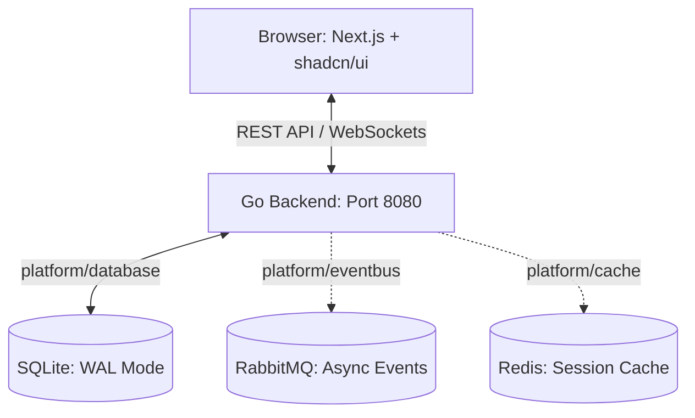

# 🌐 Social Network — Clean Architecture & Vertical Slices

A premium, high-performance social networking platform built with a **Go 1.24 Backend API** organized around Feature-Based Vertical Slices, and a modern **Next.js App Router Frontend** powered by Bun, Tailwind CSS, and shadcn/ui. 

The project features decoupled infrastructure abstractions (SQLite, PostgreSQL, Redis, and RabbitMQ), a non-blocking Event Bus, strict boundary rules, secure WebSocket/SSE real-time features, and a responsive glassmorphic design.

---

## 🏗️ System Architecture

The application separates client presentation, server business rules, and pluggable infrastructure services:



### 1. Presentation Layer (Frontend)
*   **Next.js App Router (Port 3000)**: Server-side and client-side rendering with Tailwind CSS and shadcn/ui.
*   **Real-time Communication**: Persistent WebSockets for chats and Server-Sent Events (SSE) or WebSockets for instant user notifications.
*   **Client Verification**: Native Unicode emoji parsing, magic-byte image validation, and client-side file size and extension checks before transport.

### 2. Business Logic & Feature Layer (Backend)
*   **Vertical Feature Slices (Port 8080)**: Organized under `internal/<feature>/`. Each slice wraps domain entities, CQRS commands/queries, HTTP/WebSocket transports, and SQLite storage implementations.
*   **Cross-Cutting Core**: Reusable utilities, session tracking, WebSocket hubs, and route routers live under `internal/core/`.

### 3. Decoupled Platform Services
*   **Infrastructure Adaptability**: Databases, event brokers, and caches sit behind abstract interfaces in `internal/platform/`. Changing the concrete implementation (e.g., swapping SQLite for PostgreSQL or in-memory events for RabbitMQ) requires zero modification to feature slices.

---

## 🌟 Core Features (Finished Product)

### 🔐 Authentication & Session Persistence
*   **Rich Registration**: Custom flow requiring Email, Password, First Name, Last Name, and Date of Birth. Optional Avatar, Nickname, and About Me info.
*   **Secure Sessions**: Persistent double-cookie auth (`access_token` and `refresh_token` rotation) behind `HttpOnly` and secure flags.
*   **OAuth Delegation**: Built-in GitHub and Google authentication.

### 👥 Follows & Profile Privacy
*   **Privacy Toggle**: Seamlessly switch profiles between **Public** and **Private** via a confirmation overlay.
*   **Auto-follow / Request Flow**: Public profiles accept follows instantly. Private profiles create a follow request, triggering a notification for the user to Accept or Decline.

### 📝 Posts, Comments & Visibility Scopes
*   **Image Support**: Attach JPEG, PNG, and GIF files (magic-byte validated).
*   **Privacy Scopes**:
    *   `public`: Visible to everyone.
    *   `almost private`: Restrained to current followers.
    *   `private`: Restricted to selected followers chosen via a user picker.

### 💬 Real-Time Unified Chat
*   **Real-time Handshake**: Secure WebSocket connections with session token checks on handshakes.
*   **Follower Validation**: Direct messages are follow-gated (at least one user must follow the other).
*   **Rich Client UX**: Unicode emoji support, typing indicators, active presence tracking, and message-read status.
*   **Group Chats**: Automatic WebSocket rooms created for group members.

### 🏛️ Groups & Events Lifecycle
*   **Group Spaces**: Create groups with title/description, invite followers, request to join, and publish group-exclusive posts.
*   **Event Planning**: Schedule events with a title, description, date/time, and RSVP options (Going vs. Not Going). RSVPs sync in real-time.

### 🔔 Live Notifications Stream
*   Dedicated panel (visually distinct from chat messages) showing instant alerts for:
    *   Follow requests received & accepted.
    *   Group invitations & join requests.
    *   Group event creation.

---

## 🏛️ Core Design Decisions (D1–D6)

Every developer and sub-agent must adhere to these architectural guidelines:

| Decision | Area | Summary & Rule |
| :--- | :--- | :--- |
| **D1** | **Vertical Slices** | All business logic for a feature lives in `internal/<feature>/`. Commands (writes) and queries (reads) reside in separate files inside `commands/` and `queries/`. Stores and transports are thin, unified per-feature. |
| **D2** | **Interface Strategy** | Within a slice, commands/queries accept the full `Repository` interface from `<feature>.go`. Across slices, consumer features define narrow local interfaces satisfied implicitly via Go duck typing. |
| **D3** | **Communication** | Slice communication is ID-only for data references, narrow local interfaces for synchronous checks, and the Platform Event Bus for mutation side effects. |
| **D4** | **Database Access** | Feature stores accept `platform/database.DB` interfaces rather than raw `*sql.DB`. The connection factory switches between SQLite (WAL mode + busy timeout) and PostgreSQL dynamically. |
| **D5** | **Boundary Rules** | Feature logic and command/query packages **must not** import their own `transport/` or `store/` folders, nor can they import transport/store directories of other features. |
| **D6** | **Dependency Graph** | The import tree must remain strictly acyclic (e.g. `user` and `session` have no dependencies on higher-level features, `notification` is a pure subscriber with zero external feature imports). |

---

## 📂 Project Structure

```
.
├── cmd/
│   └── server/
│       └── main.go                  # Application entry point & configuration bootstrap
├── db/
│   └── migrations/                  # Sequential up/down SQL database migrations
├── internal/
│   # ─── Vertical Feature Slices ───
│   ├── user/                        # Profiles, registration, privacy toggles
│   ├── follow/                      # Follow relationships & pending requests
│   ├── topic/                       # Posts, feed visibility, voting rules
│   ├── comment/                     # Image-supported comments
│   ├── group/                       # Communities, group posts, group chat
│   ├── event/                       # Group events & RSVP tracking
│   ├── chat/                        # Direct messages, presence, and chat history
│   ├── notification/                # Event bus subscriber notifications
│   ├── oauth/                       # Github/Google authentication pipelines
│   #
│   # ─── Cross-Cutting Core ───
│   ├── core/
│   │   ├── middleware/              # Auth, CORS, logging, rate limiter
│   │   ├── realtime/                # WebSocket hub and connection routing
│   │   ├── server/                  # HTTP engine & graceful shutdown
│   │   └── session/                 # Session lifecycle and token stores
│   #
│   # ─── Platform Abstractions ───
│   ├── platform/
│   │   ├── cache/                   # Memory cache & Redis wrappers
│   │   ├── database/                # DB factory and migrations runner
│   │   └── eventbus/                # Event publishing channels
│   #
│   # ─── Bootstrap & Helpers ───
│   ├── bootstrap/                   # Composition root & service wiring
│   ├── config/                      # Configuration loader
│   └── pkg/                         # Shared helpers (bcrypt, uuid, validators, imgutil)
│
└── frontend/                        # Next.js Application Root (TypeScript + Bun)
```

---

## 🛠️ Technology & Tooling

### Languages & Runtimes
*   **Backend**: Go 1.24
*   **Frontend**: TypeScript (Next.js App Router, Bun Runtime)
*   **Database**: SQLite3 (Production: WAL mode enabled; Dev/Testing: In-Memory / Local DB)
*   **Containers**: Docker & Docker Compose v5.1.1

### Tooling Breakdown
| Layer | Phase | Tool | Target/File |
| :--- | :--- | :--- | :--- |
| **Backend** | Testing | `go test -race -coverprofile` | `Makefile` (`make test`) |
| **Backend** | Linting | `golangci-lint` (v2.2.1) | `.golangci.yml` |
| **Backend** | Static Analysis | `staticcheck` | `Makefile` (`make lint`) |
| **Backend** | Formatting | `gofmt -s`, `gofumpt` | `Makefile` (`make format`) |
| **Backend** | Vuln Check | `govulncheck` | Local execution |
| **Frontend**| Package/Run | `Bun` | `package.json` |
| **Frontend**| Formatting/Lint | `Biome` | `biome.json` |
| **Frontend**| Testing | `Vitest` | `vitest.config.ts` |
| **Frontend**| E2E Testing | `Playwright` | `playwright.config.ts` |

---

## 🚀 Getting Started

### 📋 Prerequisites & Installation Guide

To configure your local environment for development and testing, install the following runtimes and tools:

1. **Go 1.24+**: Install the standard library runtime from [go.dev/dl](https://go.dev/dl/).
2. **Bun**: The fast JavaScript package manager and runtime. Install via:
   ```bash
   curl -fsSL https://bun.sh/install | bash
   ```
3. **Docker & Docker Compose**: Essential for orchestrating backend/frontend services in a containerized environment.
4. **Backend Quality Tooling**: Install `goimports`, `staticcheck`, and `golangci-lint` collectively by running:
   ```bash
   make tools
   ```
5. **Biome (Frontend)**: Biome handles Next.js formatting and linting. It is defined in the project package dependencies and can be run via `bun run lint` / `bun run format:check` (no global installation needed).

---

### 🐳 Running with Docker (Recommended)

1. **Configure Environment Variables**  
   Create a `.env` file at the root:
   ```env
   SERVER_PORT=8080
   CLIENT_PORT=3000
   DATABASE_DRIVER=sqlite
   DATABASE_DSN=data/social.db?_journal_mode=WAL&_busy_timeout=5000
   DB_SEED_ON_START=true
   GITHUB_CLIENT_ID=your_github_client_id
   GITHUB_CLIENT_SECRET=your_github_client_secret
   GOOGLE_CLIENT_ID=your_google_client_id
   GOOGLE_CLIENT_SECRET=your_google_client_secret
   ```

2. **Boot the Platform**  
   Build and start both the backend API and Next.js frontend services:
   ```bash
   make docker-up
   ```
   *To run the development setup with code mounting and hot reload:*
   ```bash
   make docker-dev
   ```

3. **Access points**  
   *   **Frontend web App**: [http://localhost:3000](http://localhost:3000)
   *   **Backend REST API**: [http://localhost:8080/api/v1](http://localhost:8080/api/v1)

4. **Shutdown and Clean**  
   Stop the services:
   ```bash
   make docker-down
   ```
   Purge volumes, cache, and DB files:
   ```bash
   make docker-clean
   ```

---

### 💻 Running Locally

#### 1. Setup Backend
Run the database migrations and boot the Go API Server:
```bash
# Run server (database is initialized automatically via migrations runner)
go run cmd/server/main.go
```
The local SQLite file is generated at `internal/platform/database/social.db` (or as configured).

#### 2. Setup Frontend
Install dependencies and run the Next.js development server:
```bash
cd frontend
bun install
bun run dev
```

---

## 🧪 Testing & Code Quality Gates

We enforce strict validation pipelines to ensure codebase stability.

### ⚙️ CI Pipeline
Run the automated check suite locally before pushing:
```bash
make ci
```
This runs the full gate: backend (`make be-ci`) + frontend (`make fe-ci`).
- **Backend** (`make be-ci`): `ci-mod ──> format ──> check-format ──> lint (staticcheck + golangci-lint + govulncheck) ──> test`
- **Frontend** (`make fe-ci`): `bun run lint ──> bun run format:check ──> tsc --noEmit ──> bun run test`
*   `ci-mod`: Runs `go mod tidy` and asserts no changes.
*   `format`: Runs `gofumpt` and `goimports`.
*   `lint`: Evaluates code against `staticcheck`, `golangci-lint`, and `govulncheck`.
*   `test`: Runs unit/integration tests with race checks and generates a coverage report.

### ⚛️ Frontend Validation
Run linting, formatting check, and TypeScript compilation gates:
```bash
cd frontend
bun run lint            # Biome linting
bun run format:check    # Biome formatting check
bun run typecheck       # tsc --noEmit check
bun run test            # Vitest unit & component tests
```

---

## 🤖 Agentic Workflows

This repository includes specialized configurations and tools designed to optimize the workflow of agentic AI coding assistants (like `Antigravity` and `Opencode`). Developers using agentic assistants can leverage these files for enhanced context management, token savings, and codebase navigation:

*   **⚡ Terminal Token Compression**: 
    *   [RTK (Rust Token Killer)](.agents/rules/antigravity-rtk-rules.md): Minimizes input/output token consumption by 60–90%. Always prefix terminal commands with `rtk` (e.g. `rtk git status`, `rtk make test`, `rtk go test ./...`).
*   **💬 Communication Optimization**:
    *   [Caveman Mode (.agents/skills/caveman/SKILL.md)](.agents/skills/caveman/SKILL.md): Ultra-compressed communication skill that cuts conversation token usage by ~75% while maintaining technical accuracy.
*   **📊 Codebase Knowledge Graph**:
    *   [Graphify Rule (.agents/rules/graphify.md)](.agents/rules/graphify.md) / [Graphify Skill (.agents/skills/graphify/SKILL.md)](.agents/skills/graphify/SKILL.md): Builds and queries an AST-based knowledge graph. Run `graphify query "<question>"` to BFS traverse or `graphify path "<A>" "<B>"` to trace dependencies.
*   **🤖 Core Instructions & Conventions**:
    *   [AGENTS.md](AGENTS.md): Main code guidelines, including simplicity-first principles and progressive document reading orders.
    *   [Conventions (.agents/rules/conventions.md)](.agents/rules/conventions.md): Code boundaries and architectural rules.
    *   [Karpathy Guidelines (.agents/rules/karpathy-guidelines.md)](.agents/rules/karpathy-guidelines.md): Red-Green-Refactor, TDD, and codebase change minimization guides.

---

### ⚙️ Critical Skills Installation & Dependency Management

**Agent Skills** for coding assistants (caveman, graphify, diagnose, review, tdd, etc.) are pre-installed under `.agents/skills/` and registered in `skills-lock.json`. Skills auto-activate when the agent detects a matching task. No manual install needed for existing skills.

To install new skills from a remote source (e.g. `mattpocock/skills`):
```bash
# Opencode
opencode skill install <source>/<skill-name>

# Or sync all locked skills from skills-lock.json
opencode skill sync
```

To update all skills to their latest version:
```bash
opencode skill upgrade
```

**Development Dependencies** — two runtimes, two package managers:

| Layer | Command | What it installs |
| :--- | :--- | :--- |
| **Backend (Go)** | `make tools` | `goimports`, `staticcheck`, `golangci-lint` (v2.2.1) |
| **Backend (Go modules)** | `go mod tidy` | Go library dependencies from `go.mod` |
| **Frontend (Bun/Next.js)** | `bun install` | npm packages from `frontend/package.json` |
| **Docker** | `docker compose build` | Container images for backend + frontend |

To update Go dependencies:
```bash
go get -u ./...        # update all deps
go mod tidy            # clean up
```

To update frontend dependencies:
```bash
cd frontend
bun update             # update all packages per semver ranges
```

---

## 🤝 Contribution & Onboarding Workflow

### 🚀 Developer Branch Strategy
All branches must match the naming schema: `<username>/<ticket/issue-ID>-<detail>`
*   *Username*: Gitea username from `origin` remote — known devs: `epapamic`, `ekaramet`, `dkotsi`, `geoikonomou`, `smichail`
*   *ticket/issue-ID*: Ticket ID from `docs/sprints/ticket-tracker.md` (e.g. `S3-BE-01`) or GitHub/Gitea issue number (e.g. `42`). **Required** — maps branch to work item.
*   *Detail*: kebab-case description (e.g. `db-factory`, `fix-sqlite-busy-timeout`).
*   *Examples*: `ekaramet/S1-BE-05-db-factory`, `geoikonomou/42-fix-sqlite-busy-timeout`
*   Branches must live **$\le$ 3 days** (Trunk-Based Development).

### 📝 Commit Message Convention
Squash-merged commits onto the main branch must follow the **Conventional Commits** standard:
```
<type>(<scope>)[<ID>]: <description>

[Optional Body explaining the why behind changes]
```
*   *Examples*:
    *   `feat(follow): add follow requests workflow`
    *   `fix(core): recover from websocket write panic`
    *   `refactor(topic): migrate topic store to vertical slice`

### 🏁 Definition of Done (DoD)
A task is marked completed when:
1. **TDD cycle** is fully executed (write failing test -> make it pass -> refactor).
2. **Boundary checks** (D5) verify no cross-slice http/store imports.
3. Code compiles and linting/formatting passes cleanly (`make ci`).
4. PR follows the standard PR description template (found in `@.github/PULL_REQUEST_TEMPLATE.md`).
5. Successfully verified through targeted manual smoke tests (e.g. age locks, privacy gates, follow actions).
