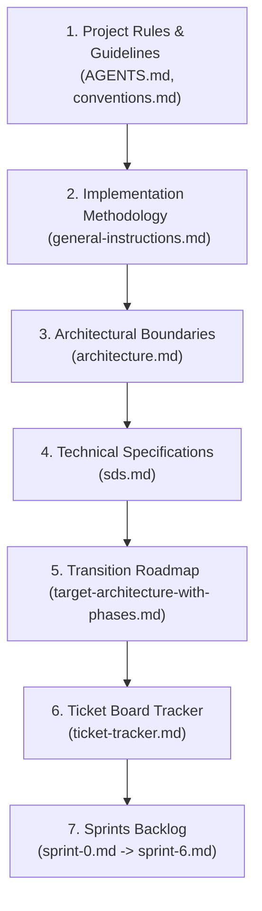

# Architecture & Sprint Implementation Audit Report

This report documents the results of a comprehensive audit comparing the architectural specification files in `docs/architecture/` with the implementation sprint files in `docs/sprints/`. It identifies critical sync discrepancies, functional gaps, and ordering conflicts, proposing specific resolutions and a linear progressive disclosure chain for implementation.

**Status:** **RESOLVED** — All identified gaps and discrepancies have been fixed in the architecture and sprint plan files according to industry and Go design best practices.

---

## 1. Architectural Sync Discrepancies & Gaps

### 1.1 Database Table Types and Strangler Fig Compatibility

- **Location:** [sds.md](../architecture/sds.md) vs [general-instructions.md](../sprints/general-instructions.md)
- **Inconsistency:** `sds.md` defined `topics.id` and `comments.id` as `TEXT PRIMARY KEY` (UUIDs), and referenced them via `TEXT` fields. However, the existing legacy codebase (which must run side-by-side with the new vertical slices under the Strangler Fig pattern) defines `Topic.ID`, `Comment.ID`, and their relationships as `int` (or `INTEGER` auto-incrementing in SQLite).
- **Resolution (RESOLVED):** Modified `sds.md` database definitions to keep `INTEGER PRIMARY KEY AUTOINCREMENT` for `topics` and `comments`. Kept `user_id` instead of `author_id` in the database, and preserved the legacy `votes` schema to ensure 100% database compatibility during the transition period.

### 1.2 Group Post Comments Implementation

- **Location:** [sds.md](../architecture/sds.md) vs [sprint-4.md](../sprints/sprint-4.md)
- **Inconsistency:** `sds.md` defined a `group_post_comments` table to support commenting on group posts, but `sprint-4.md` had zero tickets to implement the backend logic or frontend components.
- **Resolution (RESOLVED):** Added backend ticket `S4-BE-23` (Group Comments Store & Commands/Queries) and frontend ticket `S4-FE-09` (Group Comments UI accordion) to Sprint 4, completing the vertical slice.

### 1.3 Comment Voting

- **Location:** [sprint-2.md](../sprints/sprint-2.md) vs [sprint-3.md](../sprints/sprint-3.md)
- **Inconsistency:** Post voting was implemented in Sprint 2, but comment voting was deferred to Sprint 3. However, Sprint 3 had no tickets to implement comment voting.
- **Resolution (RESOLVED):** Added `S3-BE-27` (Comment voting command and queries) and `S3-FE-09` (Comment card vote buttons) to Sprint 3.

### 1.4 Chat Database Migration

- **Location:** [sds.md](../architecture/sds.md) vs [sprint-5.md](../sprints/sprint-5.md)
- **Inconsistency:** `sds.md` replaces legacy `direct_chats` and `chat_messages` with new `chats` and `messages` tables, but Sprint 5 lacked database migration tickets to transition existing records.
- **Resolution (RESOLVED):** Added `S5-BE-18` (Platform: Chat Migrations) to Sprint 5, creating `db/migrations/000010_migrate_chats` to create new tables and migrate existing message history.

### 1.5 Go Struct `Status` fields vs. Database Columns

- **Location:** [sprint-3.md](../sprints/sprint-3.md) & [sprint-4.md](../sprints/sprint-4.md) vs [sds.md](../architecture/sds.md)
- **Inconsistency:** Sprint tickets described `FollowRequest`, `Invitation`, and `JoinRequest` structs with a `Status` field, but the SQL definitions in `sds.md` lacked a `status` column (relying on row presence).
- **Resolution (RESOLVED):** Updated Go entity struct definitions in Sprints 3 and 4 to remove the redundant `Status` field, aligning them with the row-presence database model (row existence denotes pending; resolution deletes the row).

### 1.6 GroupPost Title Field Discrepancy

- **Location:** [sds.md](../architecture/sds.md) vs [sprint-4.md](../sprints/sprint-4.md)
- **Inconsistency:** `sds.md` defined the `group_posts` table with `title TEXT NOT NULL`. But `sprint-4.md` defined the `GroupPost` Go entity without a `title` field.
- **Resolution (RESOLVED):** Added the `Title` field to the `GroupPost` Go entity in `S4-BE-01` and updated the creation forms/commands to accept it, ensuring consistency with the SQLite DDL schema.

### 1.7 Sequential Migration Run Ordering and Seeding

- **Location:** [sprint-1.md](../sprints/sprint-1.md) vs [sprint-2.md](../sprints/sprint-2.md) / [sprint-3.md](../sprints/sprint-3.md)
- **Inconsistency:** Sprint 1 created the seed migration `000007_seed_data.up.sql`. However, it seeded data for groups, event RSVPs, and follow relationships, which are not created until Sprints 3 and 4 (`000004`, `000005`, `000006`), causing execution errors in Sprint 1 and breaking chronological migration ordering.
- **Resolution (RESOLVED):** Renumbered the seed migration to `000009_seed_data.up.sql`. Updated `S1-BE-11` to specify that the platform migration engine implements options to toggle seeding, but the seed script itself executes at the end of the migration lifecycle (Sprint 6) once all tables exist.

### 1.8 SSE vs. Polling for Live Notifications

- **Location:** [sds.md](../architecture/sds.md) vs [sprint-3.md](../sprints/sprint-3.md)
- **Inconsistency:** `sds.md` specified SSE/WebSockets for notifications, but the sprint notes described fallback polling.
- **Resolution (RESOLVED):** Updated Sprint 3 to implement Server-Sent Events (SSE) via `GET /api/notifications/stream` (`S3-BE-24` and `S3-FE-06`) for premium live-streamed alerts, reserving 15s interval polling as a fallback.

### 1.9 Mismatched Ticket IDs Across Sprint Files

- **Location:** [ticket-tracker.md](../sprints/ticket-tracker.md) vs sprint plan files
- **Inconsistency:** The ticket IDs in the sprint plan files (e.g. `S1-BE005`, `S2-BE015`) differed from the clean sequential numbering (`S1-BE-01`, `S2-BE-01`) listed in the `ticket-tracker.md`.
- **Resolution (RESOLVED):** Audited and renamed all ticket identifiers in Sprints 1, 2, 3, 4, 5, and 6 to be in complete alignment with the ticket tracker.

---

## 2. Linear Progressive Disclosure Navigation Chain

To ensure future implementation agents can navigate the codebase and docs without dependency loops or information overload, follow this strictly ordered path:

### Stage 1: Rules and Guidelines

- Read [AGENTS.md](file:///home/ertval/code/zone-modules/social-network/AGENTS.md) first to understand code style, thinking conventions, and git branch naming.
- Read [.agents/rules/conventions.md](file:///home/ertval/code/zone-modules/social-network/.agents/rules/conventions.md) to align on vertical slice boundaries, Go packages rules, and unit testing guidelines.

### Stage 2: Methodology & Strangler Fig Strategy

- Read [general-instructions.md](file:///home/ertval/code/zone-modules/social-network/docs/sprints/general-instructions.md) to understand the TDD workflow (Red-Green-Refactor) and the Strangler Fig transition steps (how old and new packages coexist).

### Stage 3: Architecture Definition

- Read [architecture.md](file:///home/ertval/code/zone-modules/social-network/docs/architecture/architecture.md) to visualize the directory layout of vertical slices and how they decouple from platform database/cache/eventbus layers.

### Stage 4: System Design and DDL Specs

- Read [sds.md](file:///home/ertval/code/zone-modules/social-network/docs/architecture/sds.md) to check exact table DDL schemas, magic byte image validation, real-time message payloads, and middleware implementations.

### Stage 5: Execution Roadmaps

- Read [target-architecture-with-phases.md](file:///home/ertval/code/zone-modules/social-network/docs/architecture/target-architecture-with-phases.md) to understand the chronological migration phases.
- Open [ticket-tracker.md](file:///home/ertval/code/zone-modules/social-network/docs/sprints/ticket-tracker.md) to check the general ticket checklist.

### Stage 6: Sprint Implementation Slices

- Move sequentially through the sprint files:
  1. [sprint-0.md](file:///home/ertval/code/zone-modules/social-network/docs/sprints/sprint-0.md) (Scaffolding & Bug Fixes)
  2. [sprint-1.md](file:///home/ertval/code/zone-modules/social-network/docs/sprints/sprint-1.md) (Platform & Infrastructure)
  3. [sprint-2.md](file:///home/ertval/code/zone-modules/social-network/docs/sprints/sprint-2.md) (User & Topic CQRS)
  4. [sprint-3.md](file:///home/ertval/code/zone-modules/social-network/docs/sprints/sprint-3.md) (Follow, Comment & Notification)
  5. [sprint-4.md](file:///home/ertval/code/zone-modules/social-network/docs/sprints/sprint-4.md) (Group & Event Slices)
  6. [sprint-5.md](file:///home/ertval/code/zone-modules/social-network/docs/sprints/sprint-5.md) (Chat & OAuth Integration)
  7. [sprint-6.md](file:///home/ertval/code/zone-modules/social-network/docs/sprints/sprint-6.md) (Legacy Deletions & Final Bootstrap Muxing)
