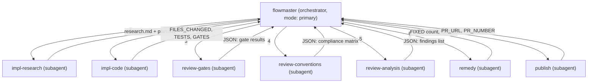

# Context Engineering & Agent Architecture Optimization

> All open questions resolved. Ready for implementation.

---

## Execution Order

| Phase | Part                                   | Effort   | Impact                                  |
| ----- | -------------------------------------- | -------- | --------------------------------------- |
| 1     | **Part 1: Context Reduction**          | ~1 hour  | Immediate 80% token savings per agent   |
| 2     | **Part 3: Deterministic Gates**        | ~3 hours | Biggest quality + cost ROI              |
| 3     | **Part 2: Flat Subagent Architecture** | ~2 hours | Architectural, better context isolation |

---

## Part 1: Context Restructuring (Option C)

### Decision

Restructure `conventions.md` with clear section markers. Each agent's context list references **specific sections by tag**, not full files. No new compact file needed — single source of truth, zero drift risk.

### What Changes

#### [MODIFY] [conventions.md](file:///home/ertval/code/zone-modules/social-network/.agents/rules/conventions.md)

Add section tags as HTML comments at the start of each section group:

```markdown
<!-- @section:rules-core — D1-D6, security, TDD (needed by all agents) -->

## 2. Vertical Slices & Boundaries

...

## 4. TDD & Go Style

...

## 6. Security

...

<!-- @section:rules-core:end -->

<!-- @section:rules-ci — CI gates, build commands (needed by gate-running agents) -->

## 8. CI & Verification

...

<!-- @section:rules-ci:end -->

<!-- @section:rules-git — Branch naming, commits, PRs (needed by publish) -->

## 9. Git & PRs

...

<!-- @section:rules-git:end -->

<!-- @section:rules-dod — Definition of Done checklist (needed by review agents) -->

## 10. Definition of Done

...

<!-- @section:rules-dod:end -->
```

> [!NOTE]
> The section tags are for **human documentation** of which agent reads what. opencode agents still load the full file — the tags tell the agent prompt "focus on sections X, Y" rather than parsing sections programmatically. This is the pragmatic approach: we can't partially load a file, but we can direct attention.

#### Agent Context Lists — What Each Agent Reads

| Agent                | Context Files                       | Sections to Focus         | Tokens (~) |
| -------------------- | ----------------------------------- | ------------------------- | ---------- |
| `remedy`             | `conventions.md`                    | `rules-core` only         | ~1,200     |
| `audit`              | `conventions.md`                    | all sections              | ~1,200     |
| `forge`              | `conventions.md`, `AGENTS.md` §1-§4 | `rules-core` + `rules-ci` | ~2,100     |
| `publish`            | `conventions.md`                    | `rules-git` + `rules-dod` | ~1,200     |
| `review-gates`       | none (runs scripts)                 | —                         | 0          |
| `review-conventions` | `conventions.md`                    | all sections              | ~1,200     |
| `review-analysis`    | `conventions.md`                    | `rules-core` only         | ~1,200     |

#### Files Dropped From All Agent Context Lists

| File                                 | Why Dropped                                                                                                                                                                  |
| ------------------------------------ | ---------------------------------------------------------------------------------------------------------------------------------------------------------------------------- |
| `general-instructions.md`            | 80% redundant with `conventions.md`. Unique content (smoke tests Q3, frontend mapping F1) is only needed during manual QA, not automated review.                             |
| `target-architecture-with-phases.md` | D5 boundary rules are already in `conventions.md` §2. Migration phases are per-ticket (read on demand). Directory tree is useful but ~7,000 tokens for ~500 tokens of value. |

#### Concrete Changes to Agent Files

##### [MODIFY] [remedy.md](file:///home/ertval/code/zone-modules/social-network/.opencode/agents/remedy.md)

```diff
 ## Context Files (read before fixing):
-Before applying any fix, read and understand the project rules so fixes are architecturally correct:
-- `.agents/rules/conventions.md` — boundary rules D1-D6, security §7, TDD §3, database §4
-- `AGENTS.md` — surgical changes principle, doc reading order, simplicity first
-- `docs/sprints/general-instructions.md` — TDD workflow R2, Strangler Fig R1, verification gates Q2
-- `docs/architecture/target-architecture-with-phases.md` — D5 boundary table, target directory tree
+Before applying any fix, read the project rules so fixes are architecturally correct:
+- `.agents/rules/conventions.md` — focus on `@section:rules-core` (D1-D6, security, TDD)
```

##### [MODIFY] [forge.md](file:///home/ertval/code/zone-modules/social-network/.opencode/agents/forge.md)

```diff
 ## Context Files (read during Research phase):
-- `.agents/rules/conventions.md` — boundary rules D1-D6, security §7, TDD §3
-- `AGENTS.md` — surgical changes principle, simplicity first
-- `docs/sprints/general-instructions.md` — TDD workflow R2, Strangler Fig R1, verification gates Q2
-- `docs/architecture/target-architecture-with-phases.md` — D5 boundary table, target directory tree
+- `.agents/rules/conventions.md` — focus on `@section:rules-core` + `@section:rules-ci`
+- `AGENTS.md` — §1-§4 only (Think, Simplicity, Surgical, Goal-Driven)
```

##### [MODIFY] [audit.md](file:///home/ertval/code/zone-modules/social-network/.opencode/agents/audit.md)

```diff
 ## Context Files (read at the start of every review):
-- `.agents/rules/conventions.md` — all D1-D6 rules, security §7, TDD §3, DoD §5
-- `AGENTS.md` — surgical changes, simplicity first, doc reading order
-- `docs/sprints/general-instructions.md` — TDD R2, Strangler Fig R1, verification gates Q2, smoke tests Q3
+- `.agents/rules/conventions.md` — ALL sections (this is the canonical rules reference)
```

---

## Part 2: Flat Subagent Architecture

### Research Finding — OpenCode Nesting

OpenCode **does** support nested subagent spawning (subagent → subagent), but:

- There is no hard recursion depth limit, creating risk of runaway nesting
- The `task` permission must be explicitly enabled on each nesting agent
- Context gets progressively more diluted at each nesting level
- Debugging nested failures is harder — you can't easily trace which level failed

### Decision: Flat Fan-Out From Orchestrator

Instead of nested spawning (`flowmaster` → `audit` → `review-gates`), use a **flat hierarchy** where `flowmaster` orchestrates ALL agents directly:



### Benefits Over Current Architecture

| Aspect                  | Before (5 agents, nested for review)                             | After (7 agents, flat)                                                                         |
| ----------------------- | ---------------------------------------------------------------- | ---------------------------------------------------------------------------------------------- |
| Review context          | audit loads everything, does 5 phases in one context window      | 3 specialized agents, each with fresh context                                                  |
| Implement context       | Single agent does research + plan + code + validate              | Research agent explores freely; code agent starts clean with plan                              |
| Orchestrator complexity | Simple loop: implement → review → fix                            | Slightly more steps, but each step is smaller                                                  |
| Debugging               | Hard to tell if review failed at gates, conventions, or analysis | Each subagent returns structured data; failure point is obvious                                |
| Token cost              | audit burns ~50 steps with bloated context                       | review-gates: ~5 steps (shell only), review-conventions: ~15 steps, review-analysis: ~15 steps |

### New Agent Files

All existing subagents keep `task: {"*": deny}` — no agent spawns another. Only `flowmaster` has `task: {"*": allow}`.

#### [NEW] [impl-research.md](file:///home/ertval/code/zone-modules/social-network/.opencode/agents/impl-research.md)

```yaml
---
description: Researches a sprint ticket — reads the spec, scans the codebase for related code, and produces a structured plan.
mode: subagent
model: opencode/deepseek-v4-flash-free
color: info
steps: 20
temperature: 0.1
permission:
  read: allow
  glob: allow
  grep: allow
  lsp: allow
  edit:
    '*': deny
    '.agents/scratch/*': allow
  bash:
    '*': deny
    cat*: allow
    grep*: allow
    head*: allow
    tail*: allow
    ls*: allow
    'go list': allow
  task:
    '*': deny
---
```

**Context**: `.agents/rules/conventions.md` (rules-core), sprint ticket spec
**Output**: `.agents/scratch/research.md` + `.agents/scratch/plan.md`

#### [NEW] [impl-code.md](file:///home/ertval/code/zone-modules/social-network/.opencode/agents/impl-code.md)

```yaml
---
description: Implements code from a structured plan using TDD. Creates the branch, writes tests first, then minimal code to pass.
mode: subagent
model: opencode/deepseek-v4-flash-free
color: success
steps: 40
temperature: 0.1
permission:
  read: allow
  glob: allow
  grep: allow
  lsp: allow
  edit: allow
  bash:
    '*': deny
    git*: allow
    make*: allow
    'go test': allow
    'go vet': allow
    'go build': allow
    'go mod': allow
    golangci-lint*: allow
    cat*: allow
    grep*: allow
    mkdir*: allow
    ls*: allow
  task:
    '*': deny
---
```

**Context**: `.agents/rules/conventions.md` (rules-core + rules-ci), `.agents/scratch/plan.md`
**Output**: Structured return with FILES_CHANGED, TESTS_ADDED, GATES

#### [NEW] [review-gates.md](file:///home/ertval/code/zone-modules/social-network/.opencode/agents/review-gates.md)

```yaml
---
description: Runs all deterministic review gates (make ci, boundary checks, migration validation, branch naming, scope drift) and returns structured JSON results.
mode: subagent
model: opencode/deepseek-v4-flash-free
color: accent
steps: 10
temperature: 0
permission:
  read: allow
  glob: allow
  grep: allow
  edit:
    '*': deny
    'docs/reviews/*': allow
  bash:
    '*': deny
    make*: allow
    'go test': allow
    'go vet': allow
    'go build': allow
    golangci-lint*: allow
    govulncheck*: allow
    bash*: allow
    cat*: allow
    grep*: allow
    git*: allow
    bun*: allow
    'tsc *': allow
  task:
    '*': deny
---
```

**Context**: None — this agent runs scripts and reports results.
**Output**: JSON gate results (structured PASS/FAIL per gate)

#### [NEW] [review-conventions.md](file:///home/ertval/code/zone-modules/social-network/.opencode/agents/review-conventions.md)

```yaml
---
description: Validates the diff against all convention rules. Produces a compliance matrix with PASS/FAIL/N-A per rule family.
mode: subagent
model: opencode/deepseek-v4-flash-free
color: accent
steps: 20
temperature: 0
permission:
  read: allow
  glob: allow
  grep: allow
  lsp: allow
  edit:
    '*': deny
  bash:
    '*': deny
    git*: allow
    cat*: allow
    grep*: allow
    head*: allow
    tail*: allow
  task:
    '*': deny
---
```

**Context**: `.agents/rules/conventions.md` (ALL sections), `git diff main..HEAD`
**Output**: Compliance matrix JSON (12 rule families, each PASS/FAIL/N-A with evidence)

#### [NEW] [review-analysis.md](file:///home/ertval/code/zone-modules/social-network/.opencode/agents/review-analysis.md)

```yaml
---
description: Deep code analysis of the diff — logic correctness, architecture boundaries, security patterns, resource lifecycle. Adversarially validates its own findings.
mode: subagent
model: opencode/deepseek-v4-flash-free
color: accent
steps: 25
temperature: 0
permission:
  read: allow
  glob: allow
  grep: allow
  lsp: allow
  edit:
    '*': deny
  bash:
    '*': deny
    git*: allow
    cat*: allow
    grep*: allow
    head*: allow
    tail*: allow
  task:
    '*': deny
---
```

**Context**: `.agents/rules/conventions.md` (rules-core only), diff output, gate results summary
**Output**: Findings list (severity, file, line, message) with adversarial self-validation

#### [MODIFY] [flowmaster.md](file:///home/ertval/code/zone-modules/social-network/.opencode/agents/flowmaster.md) — Updated Orchestration

The new flow in `flowmaster`:

```
1. Locate ticket in ticket-tracker.md, read sprint spec.
2. Spawn impl-research → receives research.md + plan.md
3. Spawn impl-code → receives FILES_CHANGED, TESTS_ADDED, GATES

Review loop (max 3 cycles):
4. Spawn review-gates → receives JSON gate results
   - If gates FAIL → spawn remedy → loop to step 4
5. Spawn review-conventions → receives compliance matrix
6. Spawn review-analysis → receives findings list
7. Synthesize report into docs/reviews/PR_<TICKET_ID>_REVIEW_REPORT.md
   - If CHANGES REQUESTED → spawn remedy → loop to step 4
   - If PASS WITH RECOMMENDATIONS after 3 cycles → proceed

8. Spawn publish → receives PR_URL
```

#### [DELETE] [forge.md](file:///home/ertval/code/zone-modules/social-network/.opencode/agents/forge.md)

Replaced by `impl-research.md` + `impl-code.md`.

#### [DELETE] [audit.md](file:///home/ertval/code/zone-modules/social-network/.opencode/agents/audit.md)

Replaced by `review-gates.md` + `review-conventions.md` + `review-analysis.md`.

---

## Part 3: Deterministic Gates

### Research Finding — Best Practice

The 2025/2026 industry standard is a **hybrid approach**:

1. **`depguard` (already in your golangci-lint)** handles import boundary rules. You already have `domain_boundary` and `pkg_boundary` rules — extend these for the vertical slice D5 rules.
2. **Shell scripts** handle non-linter-shaped checks (migration sequences, branch naming, scope drift, test coverage).
3. **`go/analysis` custom linter** is overkill for your use case — `depguard` already does import boundary checking at the AST level through golangci-lint.

### What Already Exists (Leverage This)

Your [.golangci.yml](file:///home/ertval/code/zone-modules/social-network/.golangci.yml) already has:

```yaml
depguard:
  rules:
    domain_boundary:
      files: [internal/domain/**]
      deny:
        - pkg: "social-network/internal/app"
        - pkg: "social-network/internal/infra"
        ...
    pkg_boundary:
      files: [internal/pkg/**]
      deny: [...]
```

This is the exact mechanism for D5 — we just need to **add vertical-slice boundary rules**.

### Proposed Changes

#### [MODIFY] [.golangci.yml](file:///home/ertval/code/zone-modules/social-network/.golangci.yml) — Add D5 Boundary Rules

Add these depguard rules alongside the existing `domain_boundary` and `pkg_boundary`:

```yaml
depguard:
  rules:
    # Existing rules stay...
    domain_boundary: { ... }
    pkg_boundary: { ... }

    # NEW: D5 Vertical Slice Boundary Rules
    d5_feature_root:
      # feature.go + commands/ + queries/ must not import own transport/ or store/
      files:
        - 'internal/*/commands/**'
        - 'internal/*/queries/**'
      deny:
        - pkg: 'social-network/internal/*/transport'
          desc: 'D5: commands/queries must not import transport'
        - pkg: 'social-network/internal/*/store'
          desc: 'D5: commands/queries must not import store'

    d5_transport:
      # transport/ must not import store/
      files:
        - 'internal/*/transport/**'
      deny:
        - pkg: 'social-network/internal/*/store'
          desc: 'D5: transport must not import store'

    d5_store:
      # store/ must not import transport/, commands/, queries/
      files:
        - 'internal/*/store/**'
      deny:
        - pkg: 'social-network/internal/*/transport'
          desc: 'D5: store must not import transport'
        - pkg: 'social-network/internal/*/commands'
          desc: 'D5: store must not import commands'
        - pkg: 'social-network/internal/*/queries'
          desc: 'D5: store must not import queries'

    d6_notification_never_imported:
      files:
        - 'internal/**'
        - '!internal/notification/**'
        - '!internal/bootstrap/**'
      deny:
        - pkg: 'social-network/internal/notification'
          desc: 'D6: notification is a pure subscriber — never imported by other features'
```

> [!IMPORTANT]
> **Depguard glob behavior**: Verify that `internal/*/transport` matches nested paths correctly. If depguard doesn't support single-level wildcards this way, the fallback is to enumerate feature names explicitly (e.g., `social-network/internal/user/store`, `social-network/internal/follow/store`, etc.). Test after adding.

#### [NEW] `scripts/gates/` — Shell Scripts for Non-Linter Checks

Each script exits 0 (pass) or 1 (fail) and prints a structured JSON report to stdout.

##### [NEW] [scripts/gates/run-all.sh](file:///home/ertval/code/zone-modules/social-network/scripts/gates/run-all.sh)

Master runner. Invokes each gate script, collects results, outputs combined JSON.

```bash
#!/usr/bin/env bash
set -euo pipefail
GATES_DIR="$(cd "$(dirname "$0")" && pwd)"
RESULTS=()
OVERALL=0

for gate in "$GATES_DIR"/check-*.sh; do
  name=$(basename "$gate" .sh | sed 's/^check-//')
  output=$("$gate" 2>&1) && status="PASS" || { status="FAIL"; OVERALL=1; }
  RESULTS+=("{\"gate\":\"$name\",\"status\":\"$status\",\"output\":$(echo "$output" | python3 -c 'import sys,json; print(json.dumps(sys.stdin.read()))' 2>/dev/null || echo '""')}")
done

echo "{\"overall\":\"$([ $OVERALL -eq 0 ] && echo PASS || echo FAIL)\",\"gates\":[$(IFS=,; echo "${RESULTS[*]}")]}"
exit $OVERALL
```

##### [NEW] [scripts/gates/check-branch.sh](file:///home/ertval/code/zone-modules/social-network/scripts/gates/check-branch.sh)

Validates branch naming (`<username>/<ticket-ID>-<detail>`) and conventional commits.

```bash
#!/usr/bin/env bash
BRANCH=$(git branch --show-current)
# Branch naming: username/TICKET-ID-detail
if ! echo "$BRANCH" | grep -qP '^(epapamic|ekaramet|dkotsi|geoikonomou|smichail)/S\d+-[A-Z]+-\d+-[a-z0-9-]+$'; then
  echo "FAIL: Branch '$BRANCH' does not match <username>/<ticket-ID>-<detail>"
  exit 1
fi

# Conventional commits
ALLOWED_TYPES="feat|fix|refactor|test|chore|docs"
ALLOWED_SCOPES="user|topic|follow|group|event|chat|notification|oauth|core|platform|comment|tracker"
BAD_COMMITS=$(git log --oneline main..HEAD | grep -vP "^[0-9a-f]+ ($ALLOWED_TYPES)\(($ALLOWED_SCOPES)\): " || true)
if [ -n "$BAD_COMMITS" ]; then
  echo "FAIL: Non-conventional commits found:"
  echo "$BAD_COMMITS"
  exit 1
fi
echo "PASS"
```

##### [NEW] [scripts/gates/check-migrations.sh](file:///home/ertval/code/zone-modules/social-network/scripts/gates/check-migrations.sh)

Validates migration file naming, sequential IDs, up/down pairs, and delimiter.

```bash
#!/usr/bin/env bash
MIGRATION_DIR="db/migrations"
[ -d "$MIGRATION_DIR" ] || { echo "PASS: No migrations directory"; exit 0; }

ERRORS=""

# Check sequential IDs
for f in "$MIGRATION_DIR"/*.up.sql; do
  base=$(basename "$f" .up.sql)
  down="$MIGRATION_DIR/${base}.down.sql"
  [ -f "$down" ] || ERRORS="$ERRORS\nMissing down migration: $down"
done

# Check delimiter (must use ";" never ":")
BAD_DELIM=$(grep -rn '":' "$MIGRATION_DIR"/*.sql 2>/dev/null | grep -v '^\s*--' || true)
if [ -n "$BAD_DELIM" ]; then
  ERRORS="$ERRORS\nBad delimiter found (use ';' not ':'):\n$BAD_DELIM"
fi

if [ -n "$ERRORS" ]; then
  echo -e "FAIL:$ERRORS"
  exit 1
fi
echo "PASS"
```

##### [NEW] [scripts/gates/check-scope-drift.sh](file:///home/ertval/code/zone-modules/social-network/scripts/gates/check-scope-drift.sh)

Checks that changed files belong to the ticket's feature slice.

```bash
#!/usr/bin/env bash
# Usage: check-scope-drift.sh <expected-feature> (e.g., "user", "follow")
FEATURE="${1:-}"
[ -z "$FEATURE" ] && { echo "PASS: No feature specified, skipping scope drift check"; exit 0; }

CHANGED=$(git diff --name-only main..HEAD)
UNEXPECTED=$(echo "$CHANGED" | grep -v "^internal/$FEATURE/" | grep -v "^internal/bootstrap/" | \
  grep -v "^internal/core/" | grep -v "^internal/platform/" | grep -v "^internal/pkg/" | \
  grep -v "^db/migrations/" | grep -v "^docs/" | grep -v "^\.agents/" | \
  grep -v "^Makefile$" | grep -v "^go\.\(mod\|sum\)$" | \
  grep -v "^cmd/" | grep -v "^frontend/" || true)

if [ -n "$UNEXPECTED" ]; then
  echo "FAIL: Files outside expected scope ($FEATURE):"
  echo "$UNEXPECTED"
  exit 1
fi
echo "PASS"
```

##### [NEW] [scripts/gates/check-tdd.sh](file:///home/ertval/code/zone-modules/social-network/scripts/gates/check-tdd.sh)

Checks that new command/query files have corresponding test files.

```bash
#!/usr/bin/env bash
NEW_FILES=$(git diff --name-only --diff-filter=A main..HEAD)
MISSING=""

for f in $NEW_FILES; do
  case "$f" in
    internal/*/commands/*.go|internal/*/queries/*.go)
      # Skip test files themselves
      echo "$f" | grep -q '_test\.go$' && continue
      TEST_FILE="${f%.go}_test.go"
      [ -f "$TEST_FILE" ] || MISSING="$MISSING\n$f → missing $TEST_FILE"
      ;;
  esac
done

if [ -n "$MISSING" ]; then
  echo -e "FAIL: New command/query files without tests:$MISSING"
  exit 1
fi
echo "PASS"
```

##### [NEW] [scripts/gates/check-security.sh](file:///home/ertval/code/zone-modules/social-network/scripts/gates/check-security.sh)

Checks for common security anti-patterns in changed files.

```bash
#!/usr/bin/env bash
CHANGED=$(git diff --name-only main..HEAD | grep '\.go$' || true)
[ -z "$CHANGED" ] && { echo "PASS: No Go files changed"; exit 0; }

ERRORS=""

# SQL injection: fmt.Sprintf with SQL keywords
SQLI=$(grep -Hn 'fmt\.Sprintf.*\(SELECT\|INSERT\|UPDATE\|DELETE\|WHERE\|ORDER BY\)' $CHANGED 2>/dev/null || true)
[ -n "$SQLI" ] && ERRORS="$ERRORS\nPossible SQL injection (string interpolation):\n$SQLI"

# ORDER BY without whitelist
ORDERBY=$(grep -Hn 'ORDER BY.*%' $CHANGED 2>/dev/null || true)
[ -n "$ORDERBY" ] && ERRORS="$ERRORS\nORDER BY with interpolation (use whitelist):\n$ORDERBY"

# bcrypt cost < 12
BCRYPT=$(grep -Hn 'bcrypt\.GenerateFromPassword' $CHANGED 2>/dev/null | grep -v 'cost.*1[2-9]\|cost.*[2-9][0-9]' || true)
[ -n "$BCRYPT" ] && ERRORS="$ERRORS\nbcrypt cost may be < 12:\n$BCRYPT"

# CheckOrigin returning true unconditionally
WSORIGIN=$(grep -Hn 'CheckOrigin.*return true' $CHANGED 2>/dev/null || true)
[ -n "$WSORIGIN" ] && ERRORS="$ERRORS\nWebSocket CheckOrigin returns true unconditionally:\n$WSORIGIN"

if [ -n "$ERRORS" ]; then
  echo -e "FAIL:$ERRORS"
  exit 1
fi
echo "PASS"
```

##### [NEW] [scripts/gates/check-stack.sh](file:///home/ertval/code/zone-modules/social-network/scripts/gates/check-stack.sh)

Validates Go version, module path, SQLite config.

```bash
#!/usr/bin/env bash
ERRORS=""

# Go version in go.mod
GO_VER=$(grep '^go ' go.mod | awk '{print $2}')
[[ "$GO_VER" == 1.24* ]] || ERRORS="$ERRORS\ngo.mod version is $GO_VER, expected 1.24.x"

# Module path
MOD_PATH=$(grep '^module ' go.mod | awk '{print $2}')
[ "$MOD_PATH" = "social-network" ] || ERRORS="$ERRORS\nModule path is '$MOD_PATH', expected 'social-network'"

if [ -n "$ERRORS" ]; then
  echo -e "FAIL:$ERRORS"
  exit 1
fi
echo "PASS"
```

#### [MODIFY] [Makefile](file:///home/ertval/code/zone-modules/social-network/Makefile) — New Target

```makefile
review-gates: ## Run all deterministic review gates (boundary, branch, migration, security, TDD)
	@echo "==> Running review gates..."
	@bash scripts/gates/run-all.sh
```

### How Agents Use Gate Output

The `review-gates` subagent runs:

```bash
make ci && make review-gates
```

It captures the JSON output and returns it as a structured result. The orchestrator (`flowmaster`) passes the gate results to `review-conventions` and `review-analysis` so they skip re-checking what gates already covered.

### What the LLM Still Does (Cannot Be Automated)

| Check                                                | Why LLM Required                                                                         |
| ---------------------------------------------------- | ---------------------------------------------------------------------------------------- |
| Cross-slice SQL joins detection                      | Requires understanding of which tables belong to which feature — semantic, not syntactic |
| Infrastructure patterns (healthz, graceful shutdown) | Requires understanding code intent                                                       |
| Logic correctness (race conditions, resource leaks)  | Requires reasoning about program flow                                                    |
| Architecture intent violations                       | When code technically passes D5 but violates the spirit of vertical slices               |
| Error handling adequacy                              | Whether error paths are covered, not just whether errors exist                           |

---

## Summary of All File Changes

### New Files (7)

| File                                                                        | Purpose                                    |
| --------------------------------------------------------------------------- | ------------------------------------------ |
| `.opencode/agents/impl-research.md`                                         | Research subagent for ticket investigation |
| `.opencode/agents/impl-code.md`                                             | Coding subagent for TDD implementation     |
| `.opencode/agents/review-gates.md`                                          | Deterministic gate runner                  |
| `.opencode/agents/review-conventions.md`                                    | Convention compliance checker              |
| `.opencode/agents/review-analysis.md`                                       | Deep code analysis                         |
| `scripts/gates/run-all.sh`                                                  | Master gate runner                         |
| `scripts/gates/check-{branch,migrations,scope-drift,tdd,security,stack}.sh` | Individual gate scripts (6 files)          |

### Modified Files (5)

| File                             | Change                              |
| -------------------------------- | ----------------------------------- |
| `.agents/rules/conventions.md`   | Add section tags                    |
| `.opencode/agents/remedy.md`     | Slim context list                   |
| `.opencode/agents/flowmaster.md` | New 7-agent flat orchestration flow |
| `.opencode/agents/publish.md`    | Slim context list (minor)           |
| `.golangci.yml`                  | Add D5/D6 depguard rules            |
| `Makefile`                       | Add `review-gates` target           |

### Deleted Files (2)

| File                        | Replaced By                                                        |
| --------------------------- | ------------------------------------------------------------------ |
| `.opencode/agents/forge.md` | `impl-research.md` + `impl-code.md`                                |
| `.opencode/agents/audit.md` | `review-gates.md` + `review-conventions.md` + `review-analysis.md` |

---

## Verification Plan

### Part 1 Verification

- Edit agent `.md` files to reference fewer context files
- Run `flowmaster` on a test ticket — verify no regression in review quality
- Compare token usage before/after (check opencode step counts)

### Part 3 Verification

- Implement each gate script
- Run `bash scripts/gates/check-branch.sh` on current branch — verify expected output
- Run `make review-gates` — verify combined JSON output
- Add depguard rules to `.golangci.yml`, run `golangci-lint run` — verify D5 violations are caught
- Introduce a deliberate D5 violation (e.g., import `store/` from `commands/`), confirm lint failure

### Part 2 Verification

- Create new agent `.md` files
- Update `flowmaster.md` orchestration logic
- Dry-run full pipeline on a test ticket
- Verify each subagent returns structured data
- Verify report synthesis combines all inputs correctly
