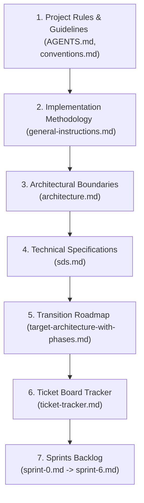

# Architecture & Sprint Implementation Audit Report

This report documents the results of a comprehensive audit comparing the architectural specification files in `docs/plan/architecture/` with the implementation sprint files in `docs/plan/sprints/`. It identifies critical sync discrepancies, functional gaps, and ordering conflicts, proposing specific resolutions and a linear progressive disclosure chain for implementation.

---

## 1. Architectural Sync Discrepancies & Gaps

### 1.1 Database Table Types and Strangler Fig Compatibility (Critical)
* **Location:** [sds.md](../architecture/sds.md) vs [general-instructions.md](../sprints/general-instructions.md)
* **Inconsistency:** `sds.md` defines `topics.id` and `comments.id` as `TEXT PRIMARY KEY` (UUIDs), and references them via `TEXT` fields (e.g., `comments.topic_id`). However, the existing legacy codebase (which must run side-by-side with the new vertical slices under the Strangler Fig pattern) defines `Topic.ID`, `Comment.ID`, and their relationships as `int` (or `INTEGER` auto-incrementing in SQLite).
* **Impact:** Changing the columns in SQLite to `TEXT` (UUIDs) during the transition sprints (Sprint 2/3) will instantly break all queries in the legacy Go code (which is not deleted until Sprint 6). SQLite scanning will fail when trying to write UUID strings into integer fields of the legacy domain models.
* **Resolution:** 
  1. Modify the target architecture to keep `id INTEGER PRIMARY KEY AUTOINCREMENT` for `topics` and `comments`.
  2. Alternatively, defer the table recreation and UUID conversion to Sprint 6 (after the legacy code is dropped), or use double-schema views during the transition. Keeping `INTEGER` IDs is the simplest and safest path.

### 1.2 Group Post Comments Implementation (Functional Gap)
* **Location:** [sds.md](../architecture/sds.md) vs [sprint-4.md](../sprints/sprint-4.md)
* **Inconsistency:** `sds.md` defines a `group_post_comments` table to support commenting on group posts. However, `sprint-4.md` (which covers Group & Event features) has zero tickets or steps implementing the backend commands, queries, repositories, transport handlers, or frontend UI components for group post comments.
* **Impact:** The database schema is defined for group comments, but no code will be generated to support it, leaving the group posts feed incomplete.
* **Resolution:** Add a new BE ticket (`S4-BE-23: Group: Post Comments`) and a corresponding FE ticket (`S4-FE-09: Group: Comment Components`) to Sprint 4 to implement the entity, commands, queries, and UI components for group comments.

### 1.3 Comment Voting (Functional Gap)
* **Location:** [sprint-2.md](../sprints/sprint-2.md) vs [sprint-3.md](../sprints/sprint-3.md)
* **Inconsistency:** In `sprint-2.md` (`S2-BE-13`), post voting is implemented but comment voting is explicitly deferred: *"Defer TargetType: comment to Sprint 3 (comment slice) to avoid hidden topic → comment dependency (arch D6)."* However, `sprint-3.md` contains absolutely no tickets for implementing comment voting.
* **Impact:** Comment voting is completely omitted from the sprint execution backlog.
* **Resolution:** Add a ticket to Sprint 3 (`S3-BE-27: Comment: Cast Vote Command & Queries`) and a frontend ticket (`S3-FE-09: Comment Card Vote Buttons`) to allow voting on comments.

### 1.4 Chat Database Migration (Functional Gap)
* **Location:** [sds.md](../architecture/sds.md) vs [sprint-5.md](../sprints/sprint-5.md)
* **Inconsistency:** `sds.md` replaces the old `direct_chats` and `chat_messages` tables with `chats` and `messages` tables (featuring clean column renames and UUID primary keys for messages). However, `sprint-5.md` lists no database migration tickets to transition the schema and migrate existing message history.
* **Impact:** Running Sprint 5 without a database migration will cause a failure since the new code will query non-existent tables or mismatch columns.
* **Resolution:** Add a migration ticket to Sprint 5 (`S5-BE-18: Platform: Chat Migrations`) to create the `chats` and `messages` tables and migrate the data from the legacy tables.

### 1.5 Go Struct `Status` fields vs. Database Columns (Schema Mismatch)
* **Location:** [sprint-3.md](../sprints/sprint-3.md) & [sprint-4.md](../sprints/sprint-4.md) vs [sds.md](../architecture/sds.md)
* **Inconsistency:** The sprint tickets describe `FollowRequest`, `Invitation`, and `JoinRequest` structs with a `Status: pending/accepted/declined` field. However, the database tables `follow_requests`, `group_invitations`, and `group_join_requests` in `sds.md` do not contain a `status` column. They rely on row presence (e.g., if a row exists, it is pending; on accept/decline, the row is deleted).
* **Impact:** Developer confusion on how to persist or read request/invitation statuses.
* **Resolution:** Either:
  - Remove the `Status` field from the Go structs (they are implicitly pending by existing in the database table).
  - Update `sds.md` DDL to add a `status TEXT NOT NULL DEFAULT 'pending'` column to these tables. The row-presence model is simpler and matches the SQLite design.

### 1.6 GroupPost Title Field Discrepancy (Entity Mismatch)
* **Location:** [sds.md](../architecture/sds.md) vs [sprint-4.md](../sprints/sprint-4.md)
* **Inconsistency:** `sds.md` defines `group_posts` table with `title TEXT NOT NULL`. But `sprint-4.md` (`S4-BE-01`) defines the `GroupPost` Go entity as: `GroupPost (ID, GroupID, AuthorID, Content, ImagePath, CreatedAt)` which has no `Title` field.
* **Impact:** Inserting a group post via the Go command will fail because the `title` field is not supplied but is marked `NOT NULL` in the DB schema, or the entity struct will be missing a required column.
* **Resolution:** Add `Title` to the `GroupPost` Go entity in `S4-BE-01` and update the create group post form/command to accept it, aligning with the `group_posts` database schema.

### 1.7 Sequential Migration Run Ordering and Seeding (Logical Conflict)
* **Location:** [sprint-1.md](../sprints/sprint-1.md) vs [sprint-2.md](../sprints/sprint-2.md) / [sprint-3.md](../sprints/sprint-3.md)
* **Inconsistency:** Sprint 1 creates the seed migration `000007_seed_data.up.sql`. However, it seeds data for groups, event RSVPs, and follow relationships. These tables are not created until Sprints 3 and 4 (`000004`, `000005`, `000006`). If `000007` is run in Sprint 1, it will fail due to missing tables. Furthermore, having version `000007` in Sprint 1 breaks the sequential migration numbering since Sprint 2 creates `000002` and `000003`.
* **Impact:** The migration runner will fail in development mode during Sprint 1. It will also refuse to run lower-numbered migrations (`000002`–`000006`) later because version `000007` was already applied.
* **Resolution:** 
  1. Renumber the seed migration to `000009_seed_data.up.sql`.
  2. Implement and execute this seed migration during Sprint 6 (Cleanup & Integration) or at the end of Sprint 4, when all schemas have been defined.

### 1.8 SSE vs. Polling for Live Notifications (Aesthetic Discrepancy)
* **Location:** [sds.md](../architecture/sds.md) vs [sprint-3.md](../sprints/sprint-3.md)
* **Inconsistency:** `sds.md` specifies *"SSE or WebSockets for live notifications"*. But `sprint-3.md` explicitly specifies *"no SSE. FE must poll... polls GET /api/notifications/unread-count on a 15-second interval"*.
* **Impact:** Polling increases database load and decreases responsiveness. It does not provide the premium live-streamed UX described in the architecture.
* **Resolution:** Update the sprint plan to implement actual Server-Sent Events (SSE) or WebSocket push for live notifications in Sprint 3 to match the architectural standard, rather than falling back to polling.

---

## 2. Linear Progressive Disclosure Navigation Chain

To ensure future implementation agents can navigate the codebase and docs without dependency loops or information overload, follow this strictly ordered path:

### Stage 1: Rules and Guidelines
* Read [AGENTS.md](file:///home/ertval/code/zone-modules/social-network/AGENTS.md) first to understand code style, thinking conventions, and git branch naming.
* Read [.agents/rules/conventions.md](file:///home/ertval/code/zone-modules/social-network/.agents/rules/conventions.md) to align on vertical slice boundaries, Go packages rules, and unit testing guidelines.

### Stage 2: Methodology & Strangler Fig Strategy
* Read [general-instructions.md](file:///home/ertval/code/zone-modules/social-network/docs/plan/sprints/general-instructions.md) to understand the TDD workflow (Red-Green-Refactor) and the Strangler Fig transition steps (how old and new packages coexist).

### Stage 3: Architecture Definition
* Read [architecture.md](file:///home/ertval/code/zone-modules/social-network/docs/plan/architecture/architecture.md) to visualize the directory layout of vertical slices and how they decouple from platform database/cache/eventbus layers.

### Stage 4: System Design and DDL Specs
* Read [sds.md](file:///home/ertval/code/zone-modules/social-network/docs/plan/architecture/sds.md) to check exact table DDL schemas, magic byte image validation, real-time message payloads, and middleware implementations.

### Stage 5: Execution Roadmaps
* Read [target-architecture-with-phases.md](file:///home/ertval/code/zone-modules/social-network/docs/plan/architecture/target-architecture-with-phases.md) to understand the chronological migration phases.
* Open [ticket-tracker.md](file:///home/ertval/code/zone-modules/social-network/docs/plan/sprints/ticket-tracker.md) to check the general ticket checklist.

### Stage 6: Sprint Implementation Slices
* Move sequentially through the sprint files:
  1. [sprint-0.md](file:///home/ertval/code/zone-modules/social-network/docs/plan/sprints/sprint-0.md) (Scaffolding & Bug Fixes)
  2. [sprint-1.md](file:///home/ertval/code/zone-modules/social-network/docs/plan/sprints/sprint-1.md) (Platform & Infrastructure)
  3. [sprint-2.md](file:///home/ertval/code/zone-modules/social-network/docs/plan/sprints/sprint-2.md) (User & Topic CQRS)
  4. [sprint-3.md](file:///home/ertval/code/zone-modules/social-network/docs/plan/sprints/sprint-3.md) (Follow, Comment & Notification)
  5. [sprint-4.md](file:///home/ertval/code/zone-modules/social-network/docs/plan/sprints/sprint-4.md) (Group & Event Slices)
  6. [sprint-5.md](file:///home/ertval/code/zone-modules/social-network/docs/plan/sprints/sprint-5.md) (Chat & OAuth Integration)
  7. [sprint-6.md](file:///home/ertval/code/zone-modules/social-network/docs/plan/sprints/sprint-6.md) (Legacy Deletions & Final Bootstrap Muxing)
