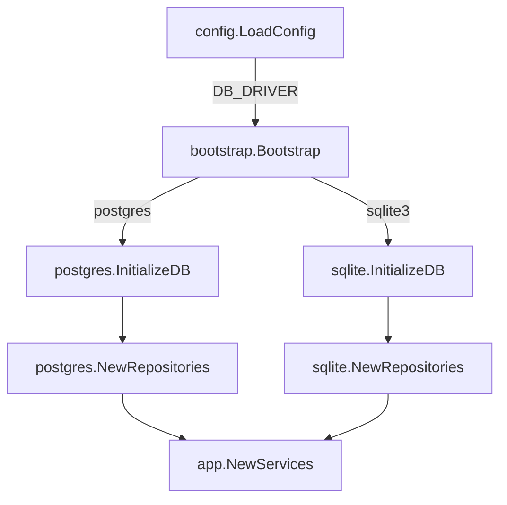

# Database Evolution Plan: Multi-Driver Support (SQLite & PostgreSQL)

This document outlines the findings from the review of the database migration branch `refactor/PostgresMigration` and proposes a best-practice strategy to dynamically support both SQLite and PostgreSQL database backends.

---

## 1. Migration Findings & Critique

A review of the current implementation in `refactor/PostgresMigration` reveals several issues that must be addressed to ensure a stable, clean, and database-agnostic application.

### A. Dead Code and Unused Configurations
* **Findings**: The SQLite repository directory (`internal/infra/storage/sqlite`) was duplicated into `internal/infra/storage/postgres`. However, the app bootstrap now hardcodes the PostgreSQL initialization.
* **Critique**: The configuration defaults (`DB_DRIVER` in `.env` and [config.go](file:///home/ertval/code/zone-modules/social-network/internal/config/config.go)) still list `sqlite3` as default, but this setting is completely ignored in `main.go`. This creates dead configuration variables and confusion for developers.

### B. Broken Compilation
* **Findings**: Running `go test ./...` currently fails because of compilation issues in the `infra` package.
* **Critique**: The file [services.go](file:///home/ertval/code/zone-modules/social-network/internal/infra/services.go) was left unmaintained. It contains unused imports and still references `sqlite.Repositories`. Any uncompilable code in the workspace must be resolved.

### C. Copy-Paste Database Initialization Bug
* **Findings**: The database connection setup functions in [init.go](file:///home/ertval/code/zone-modules/social-network/internal/infra/storage/postgres/init.go) use a convoluted return signature:
  ```go
  func OpenDB(cfg config.ServerConfig) (*sql.DB, *sql.DB, error)
  ```
* **Critique**: This was blindly copied from the SQLite setup. The second `*sql.DB` return value is always `nil`, leading to messy initialization code like:
  ```go
  db, result, err := OpenDB(cfg)
  if err != nil {
      return result, err // result is nil, which works but is bad practice
  }
  ```
  It should be refactored to return a single `(*sql.DB, error)`.

### D. Performance Bottleneck in PostgreSQL Pool Configuration
* **Findings**: The Postgres connection pool size (`DB_OPEN_CONN`) defaults to `1` in the configuration.
* **Critique**: While `MaxOpenConns = 1` is standard for SQLite to prevent lock issues, it severely throttles PostgreSQL by forcing all concurrent queries to execute serially. In addition, the pool does not configure `MaxIdleConns` and `ConnMaxLifetime`, which defaults Go to only 2 idle connections, leading to connection thrashing under load.

### E. Redundant and Confusing Schema Constraints
* **Findings**: In [000008_create_votes.up.sql](file:///home/ertval/code/zone-modules/social-network/db/postgres/migrations/000008_create_votes.up.sql), there are both table-level `UNIQUE` constraints and partial unique indexes:
  ```sql
  UNIQUE (user_id, topic_id),
  UNIQUE (user_id, comment_id)
  ```
* **Critique**: The table-level unique constraints are redundant because of the partial unique indexes `idx_topic_votes` and `idx_comment_votes`. Additionally, referencing a table-level constraint during conflicts prevents targeting specific partial indexes in PostgreSQL.

---

## 2. Proposed Best-Practice Solution: Factory Pattern

Because the domain and use-case layers are already written against database-agnostic interfaces (e.g., `user.Repository`), we can leverage a **Factory Pattern** during application bootstrap. This selects the appropriate repository engine at runtime based on the `DB_DRIVER` config variable.



### Key Implementation Details

#### 1. Dynamic Database Initialization
Modify [main.go](file:///home/ertval/code/zone-modules/social-network/cmd/server/main.go) to initialize the correct database driver dynamically:
```go
var db *sql.DB
var err error

if cfg.Database.Driver == "postgres" {
    db, err = postgres.InitializeDB(*cfg)
} else {
    db, err = sqlite.InitializeDB(*cfg)
}
if err != nil {
    log.Fatalf("Database error: %v", err)
}
defer db.Close()
```

#### 2. Dynamic Repository Construction
Update [bootstrap.go](file:///home/ertval/code/zone-modules/social-network/internal/bootstrap/bootstrap.go) to bind the domain repositories dynamically:
```go
var userRepo user.Repository
var categoryRepo category.Repository
var topicRepo topic.Repository
var commentRepo comment.Repository
var voteRepo vote.Repository
var oauthRepo oauth.Repository
var activityRepo activity.Repository
var chatRepo chat.Repository
var notificationRepo notification.Repository

if cfg.Database.Driver == "postgres" {
    repos := postgres.NewRepositories(db)
    userRepo = repos.UserRepo
    categoryRepo = repos.CategoryRepo
    topicRepo = repos.TopicRepo
    commentRepo = repos.CommentRepo
    voteRepo = repos.VoteRepo
    oauthRepo = repos.OauthRepo
    activityRepo = repos.ActivityRepo
    chatRepo = repos.ChatRepo
    notificationRepo = repos.NotificationRepo
} else {
    repos := sqlite.NewRepositories(db)
    userRepo = repos.UserRepo
    categoryRepo = repos.CategoryRepo
    topicRepo = repos.TopicRepo
    commentRepo = repos.CommentRepo
    voteRepo = repos.VoteRepo
    oauthRepo = repos.OauthRepo
    activityRepo = repos.ActivityRepo
    chatRepo = repos.ChatRepo
    notificationRepo = repos.NotificationRepo
}

services := app.NewServices(
    userRepo, categoryRepo, topicRepo, commentRepo, voteRepo,
    oauthRepo, activityRepo, chatRepo, notificationRepo,
    notifier, hub, fileStorage,
)
```

#### 3. Distinct Pool Configuration
Ensure driver-specific pool tuning is applied in [init.go](file:///home/ertval/code/zone-modules/social-network/internal/infra/storage/postgres/init.go):
```go
// For PostgreSQL
db.SetMaxOpenConns(cfg.Database.OpenConn) // Configure larger capacity e.g. 25
db.SetMaxIdleConns(cfg.Database.OpenConn) // Keep connections warm
db.SetConnMaxLifetime(5 * time.Minute)
```

---

## 3. Recommended Action Items
1. **Fix compilation errors** in [services.go](file:///home/ertval/code/zone-modules/social-network/internal/infra/services.go).
2. **Clean up OpenDB/InitializeDB** signatures.
3. **Configure connection pooling limits** for PostgreSQL.
4. **Implement the dynamic Factory check** in `main.go` and `bootstrap.go`.
5. **Verify migrations** execute and update docker compose structures for seamless local running.
