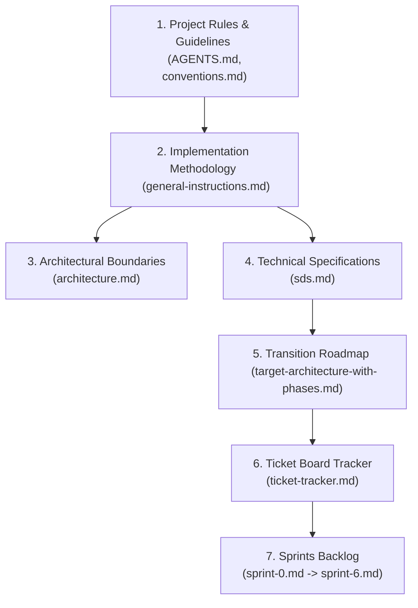

# Social Network Refactoring — General Instructions & Reference

> Derives from [target-architecture-with-phases.md](../architecture/target-architecture-with-phases.md).
> All design decisions (D1–D6) from that document apply.

---

## Meta

| Field | Value |
|-------|-------|
| Team | 5 devs (**SD-QA**, **BE-A**, **BE-B**, **FE-A**, **FE-B**) |
| Sprint length | 1 week |
| Total duration | ~7 weeks (7 sprints) |
| Methodology | TDD (Red → Green → Refactor), Strangler Fig, Trunk-Based Development |
| Branch naming | `username/<ticketID>-detail` (e.g. `geoikonomou/S1-BE-05-db-factory`) |
| Ticket format | **ID** — component, priority, dependency, assignee, story points, acceptance criteria |

---

## Linear Progressive Disclosure Navigation Chain

This project enforces a progressive reading workflow for developers and agentic assistants alike to maintain context and avoid cognitive overload:



- **Stage 1: Rules and Guidelines**: Read [AGENTS.md](file://AGENTS.md) and [.agents/rules/conventions.md](file://.agents/rules/conventions.md).
- **Stage 2: Methodology & Strangler Fig Strategy**: Read [docs/sprints/general-instructions.md](file://docs/sprints/general-instructions.md).
- **Stage 3: Architecture Definition**: Read [docs/architecture/architecture.md](file://docs/architecture/architecture.md).
- **Stage 4: System Design and DDL Specs**: Read [docs/architecture/sds.md](file://docs/architecture/sds.md).
- **Stage 5: Execution Roadmaps**: Read [docs/architecture/target-architecture-with-phases.md](file://docs/architecture/target-architecture-with-phases.md) and [docs/sprints/ticket-tracker.md](file://docs/sprints/ticket-tracker.md).
- **Stage 6: Sprint Implementation Slices**: Sprints [sprint-0.md](file://docs/sprints/sprint-0.md), [sprint-1.md](file://docs/sprints/sprint-1.md), [sprint-2.md](file://docs/sprints/sprint-2.md), [sprint-3.md](file://docs/sprints/sprint-3.md), [sprint-4.md](file://docs/sprints/sprint-4.md), [sprint-5.md](file://docs/sprints/sprint-5.md), and [sprint-6.md](file://docs/sprints/sprint-6.md).

---

## Developer Onboarding & Contribution Workflow

### Onboarding Guide

1. **Pick a Ticket**: Claim open `BE-*` / `FE-*` / `SD-QA-*` items from `docs/sprints/ticket-tracker.md`. Verify dependencies.
2. **Set Up Branch**: Standard `username/<ticketID>-detail` naming (e.g. `geoikonomou/S1-BE-05-db-factory`).
3. **Development Cycle (TDD)**: Test first (Vitest for FE, `_test.go` for BE), minimal implementation, refactor, and formatting checks.
4. **PR Guidelines**: Squash merge, run all validation gates (`make ci`), and draft description using the PR template.

### PR Description Template

Copy `.github/PULL_REQUEST_TEMPLATE.md` into `.git/PR_DESCRIPTION.md` when preparing a pull request and fill in the details.

---

## Refactoring Strategy & TDD Methodology

### R1: Strangler Fig Pattern

Old code is NOT deleted until new code routes traffic.

```
Step 1: Write contract tests against OLD API  (verify current behavior)
Step 2: Build new slice alongside old code   (no routing changes)
Step 3: Verify contract tests pass on NEW    (identical behavior)
Step 4: Swap routing in bootstrap.go         (one-line change)
Step 5: Monitor via tests + manual smoke     (confidence window)
Step 6: Delete old directories               (domain/, app/, infra/)
```

**Rule:** Old code exists until ALL its features are migrated. No partial deletion.

### R2: TDD Workflow (Red → Green → Refactor)

Applied to every command, query, and store method.

```
For each use case (one command/query file):

1. RED: Write a failing test
   - Test file: commands/<use_case>_test.go, queries/<use_case>_test.go, store/sqlite_test.go
   - Test valid path, invalid input, edge cases, error states
   - Use table-driven tests (Go idiom)
   - Use subtests with t.Run()

2. GREEN: Minimum code to pass
   - Write the command/query handler
   - Write the store method (with real SQLite in-memory DB)
   - Run: go test -race ./...

3. REFACTOR: Clean up
   - Extract helpers if duplicated 3+ times
   - Ensure boundary rules (D5) are intact
   - Run full CI: `make ci`
```

**Test file convention:**
```go
// commands/register_test.go
func TestRegisterHandler_ValidInput(t *testing.T) { ... }
func TestRegisterHandler_InvalidEmail(t *testing.T) { ... }
func TestRegisterHandler_UnderAge(t *testing.T) { ... }
func TestRegisterHandler_DuplicateUser(t *testing.T) { ... }
func TestRegisterHandler_SQLiteError(t *testing.T) { ... }
```

**Contract test pattern (for migration verification):**
```go
// internal/user/store/sqlite_migration_test.go
// Tests that new store produces identical results to old sqlite/users/userRepo.go
// These are deleted AFTER the old repo is deleted.
func TestUserStore_Migrated_SameAsOld_RegisterUser(t *testing.T) { ... }
```

### R3: Database Migration Discipline

- **Every schema change**: pair of `.up.sql` / `.down.sql` files
- **Migration ID**: sequential `000001`, `000002`, ...
- **Apply**: startup via `platform/database/migrations.go`
- **Rollback**: `go run cmd/migrate/main.go down 1`
- **Test**: each migration has integration test: apply up → verify schema → apply down → verify clean
- **Data migration safety**: never drop column in same migration; first add new column, populate, then drop old in NEXT migration

### R4: Branch Strategy

```
main ← (protected, requires CI green + review)
  ↑
  feature branch (username/<ticketID>-detail)
    ↑
    WIP commits (any message)
    ↓
  squash merge into main (single Conventional Commit)
```

- Branches live ≤ 3 days (trunk-based)
- Feature toggles for incomplete work: deploy dark, activate later
- No long-lived branches

### R5: Code Review Checklist

Every PR must pass:
- [ ] **Boundary rules** (D5): no cross-slice transport/store imports
- [ ] **Interface rules** (D2): within slice = full interface, across = narrow consumer-defined
- [ ] **Cross-slice communication** (D3): ID-only refs, consumer interfaces, event bus for mutations
- [ ] **Tests present**: unit tests for each command/query, store tests with real in-memory SQLite
- [ ] **Format + lint + test**: `make ci` green
- [ ] **No dead code**: removed imports/variables introduced by the change

---

## Frontend Standards, Quality & Best Practices

### F1: Frontend Feature-to-Audit Mapping (REQUIRED)

Maps each audit checklist item to a frontend component/page:
- `/register`: [RegisterForm](file://frontend/src/components/features/auth/RegisterForm.tsx) (Email, Password, First Name, Last Name, Date of Birth required; Avatar/Image, Nickname, About Me optional).
- `/login`: [LoginForm](file://frontend/src/components/features/auth/LoginForm.tsx) (email/username + password, Google & GitHub OAuth buttons).
- `/profile/[id]`: [ProfileCard](file://frontend/src/components/features/profile/ProfileCard.tsx) + [ProfilePosts](file://frontend/src/components/features/profile/ProfilePosts.tsx) + [FollowersList](file://frontend/src/components/features/profile/FollowersList.tsx) + [FollowingList](file://frontend/src/components/features/profile/FollowingList.tsx) (displays all registration data except password, user posts, and followers/following counts).
- `/profile/[id]`: [PrivacyToggle](file://frontend/src/components/features/profile/PrivacyToggle.tsx) with confirmation dialog + [PrivateProfileLock](file://frontend/src/components/features/profile/PrivateProfileLock.tsx) segment (shown to non-followers).
- Profile page & Followers: [FollowButton](file://frontend/src/components/features/profile/FollowButton.tsx) + [UnfollowConfirmDialog](file://frontend/src/components/features/profile/UnfollowConfirmDialog.tsx).
- `/post/new`: [PostForm](file://frontend/src/components/features/post/PostForm.tsx) + [VisibilitySelector](file://frontend/src/components/features/post/VisibilitySelector.tsx) + [AllowedUsersPicker](file://frontend/src/components/features/post/AllowedUsersPicker.tsx) (public, almost_private/followers, private+user picker) + [ImageUploader](file://frontend/src/components/features/post/ImageUploader.tsx) (JPEG, PNG, GIF).
- Post details: [CommentForm](file://frontend/src/components/features/post/CommentForm.tsx) + [ImageUploader](file://frontend/src/components/features/post/ImageUploader.tsx) (JPEG, PNG, GIF).
- `/groups/new`: [GroupForm](file://frontend/src/components/features/group/GroupForm.tsx) (title, description).
- `/groups`: [GroupDirectory](file://frontend/src/components/features/group/GroupDirectory.tsx) (browse all groups).
- `/groups/[id]`: [JoinRequestButton](file://frontend/src/components/features/group/JoinRequestButton.tsx) + [GroupFeed](file://frontend/src/components/features/group/GroupFeed.tsx) + [GroupPostForm](file://frontend/src/components/features/group/GroupPostForm.tsx).
- `/groups/[id]/events/new`: [EventForm](file://frontend/src/components/features/group/EventForm.tsx) (title, description, datetime picker, minimum 2 options).
- `/groups/[id]/events/[eventId]`: [RSVPOptions](file://frontend/src/components/features/group/RSVPOptions.tsx) (going/not going).
- `/groups/[id]/chat`: [GroupChatWindow](file://frontend/src/components/features/group/GroupChatWindow.tsx) (real-time chat room).
- `/chat/[userId]`: [ChatWindow](file://frontend/src/components/features/chat/ChatWindow.tsx) (direct chat, follow-check, emoji support).
- Global layout: [NotificationBell](file://frontend/src/components/features/notification/NotificationBell.tsx) + [NotificationPanel](file://frontend/src/components/features/notification/NotificationPanel.tsx) (visible on every page, displays: follow request accept/decline, group invite accept/decline, group join request approve/deny, and event creation alerts). Must be visually distinct from messages.

### F2: Frontend Interaction Patterns (REQUIRED)

- **Confirmation Dialogs**: Must trigger for unfollowing a user and toggling profile privacy (bonus items).
- **Follow-Gate Feedback**: If a chat is attempted between non-followed users, show clear validation: "At least one user must follow the other to initiate a chat."
- **Emoji Support**: Native Unicode emoji parsing and display in chat rooms.
- **WebSocket Reconnection (Optional/Recommended)**: Heartbeat ping-pong logic and exponential backoff reconnection.

### F3: Frontend State Management (REQUIRED)

- **Auth Persistence**: Session state must be managed via cookies (`HttpOnly`, `Secure`, `SameSite=Lax`). Session must survive page refresh and prevent localStorage leakage.
- **Session Isolation**: Logging in from Chrome and Firefox with different users must keep sessions separate. Non-logged-in browsers must remain guest sessions.
- **Server Components (Optional/Recommended)**: React Server Components (RSC) for data fetching, Client Components for interactivity.

### F4: Frontend File Handling (REQUIRED)

- **Attachment Formats**: JPEG, PNG, GIF.
- **Client Validation**: Check file size (limit to 10MB) and extension on file selection before transport to backend.

### F5: Frontend Project Structure (REQUIRED)

Define the directory mapping:
- `frontend/src/app/` (routes)
- `frontend/src/components/ui/` (shadcn primitives)
- `frontend/src/components/features/` (domain-specific composables: `auth`, `profile`, `post`, `group`, `chat`, `notification`)
- `frontend/src/lib/` (API client, session cookies helper, WS coordinator)
- `frontend/src/styles/` (Tailwind globals)

### F6: Frontend Build & Deploy (REQUIRED)

- **Runtime**: Bun package manager.
- **Dockerfile**: Standalone multi-stage Next.js builder on port 3000.
- **Gates**:
  ```bash
  bun run lint
  bun run format:check
  tsc --noEmit
  bun run test
  ```

---

## Debugging & Quality Assurance Plan

### Q1: Bug Fix First (Phase 1)

| ID | Bug | Current Location | BE Assignee |
|----|-----|------------------|-------------|
| B1.1 | Migration delimiter `":"` → `";"` | `internal/infra/storage/sqlite/init.go` | BE-A |
| B1.2 | SQLite DSN missing WAL/busy timeout | `internal/infra/storage/sqlite/init.go`, `.env` | BE-A |
| B1.3 | OAuth `Scan()` with `ctx` arg | `internal/infra/storage/sqlite/oauth/oauthRepo.go` | BE-B |
| B1.4 | WebSocket CheckOrigin returns true | `internal/infra/http/ws/handler.go` | BE-B |
| B1.5 | SQL injection in ORDER BY | `internal/infra/storage/sqlite/topics/topicRepo.go`, `internal/infra/storage/sqlite/categories/categoryRepo.go` | BE-A |
| B1.6 | Prepared stmt uses `db.Exec` | `internal/infra/storage/sqlite/users/userRepo.go` | BE-B |
| B1.7 | WS goroutine panic recovery | `internal/infra/ws/client.go` | BE-B |
| B1.8 | RateLimiter ticker leak (core GCRA, not HTTP wrapper) | `internal/infra/middleware/ratelimiter/rateLimiter.go` | BE-B |

**Process:**
1. Write reproducer test (failing) for each bug
2. Apply fix
3. Verify test passes
4. Run `make ci`

### Q2: Verification Gates (per sprint)

**Mandatory:** After every sprint, before marking complete, run:

```bash
# Full CI gate (BE + FE)
make ci

# Or individually:
make be-ci   # Backend only
make fe-ci   # Frontend only

# Boundary check
grep -rn 'import' internal/*/transport/ internal/*/store/ | grep 'internal/' | grep -v 'platform/' | grep -v 'pkg/'
```

Equivalent standalone commands if running without `make`:
```bash
go vet ./...
go build ./...
go test -race -coverprofile=coverage.out ./...
golangci-lint run
govulncheck ./...
```

### Q3: Manual Smoke Test Scenarios

Run these after each feature migration to catch regression:

| Test | Steps | Expected |
|------|-------|----------|
| A1 | Register under-13 user | Rejected (age validation) |
| A2 | Register without nickname/about | Succeeds |
| A3 | Upload non-image as avatar | Rejected (magic bytes) |
| A4 | Upload valid image as avatar | Accepted |
| B1 | Set user B private → A follows | Follow request + notification |
| B2 | A views B's profile (not accepted) | "Private" lock screen |
| B3 | B accepts → A views profile | Full profile visible |
| B4 | A unfollows | Confirmation popup, relationship severed |
| C1 | Create "almost_private" post | Visible to followers, hidden from non-followers |
| C2 | Create "private" post for specific user | Visible to selected user only |
| D1 | Create group → invite member | Member gets notification, joins |
| D2 | Create event in group | All members notified |
| D3 | RSVP going/not going | Count updates in real-time |

### Q4: Contract Testing (BE ↔ FE)

- Define OpenAPI 3.0 spec for each feature endpoint in `docs/api/<feature>.yaml`
- BE tests against spec (use `kin-openapi` or manual validation)
- FE mocks from spec (use `msw` or manual mock handlers)
- CI gate: spec must match implementation (drift detection)

### Q5: Performance Regression Check

- Each sprint: run `make ci-bench` — compare against baseline from previous sprint
- Flag any regression > 10%
- Critical paths: feed query, login, WebSocket message delivery

---

## Appendix A: Best Practices Summary

### A1: Testing Pyramid

```
    ╱ E2E ╲          ~20 tests (Playwright)
   ╱─────────╲
  ╱ Integration ╲    ~50 tests (Go: wired app, FE: component composition)
 ╱───────────────╲
╱   Unit Tests    ╲  ~300+ tests (Go: per command/query/store, FE: per component)
╰─────────────────╯
```

### A2: Commit Convention

```
type(scope): description

type: feat, fix, refactor, test, chore, docs
scope: feature name (user, topic, follow, group, event, chat, notification, oauth, core, platform)
```

Examples:
- `feat(user): add register command with age validation`
- `fix(core): recover from WebSocket goroutine panic`
- `refactor(topic): migrate topic store to vertical slice`
- `test(event): add rsvp command table-driven tests`

### A3: Feature Toggle Pattern

For greenfield features that can ship dark:

```go
// bootstrap.go
if config.Features.Follow {
    follow.RegisterRoutes(router, followSvc)
}
```

### A4: Observability (Add in Sprint 1 if time)

- Structured logging: `slog` (standard library)
- Request tracing: `X-Request-ID` header, propagated through context
- Metrics: request duration, error rate, DB query time (optional: Prometheus endpoint)

### A5: Risk Mitigation

| Risk | Mitigation |
|------|------------|
| Old code breaks during migration | Contract tests verify old API → new API behavior match |
| Migration takes too long per feature | Strangler Fig — ship one feature at a time, old code still runs |
| Breaking API change for FE | OpenAPI spec defined before BE implementation; FE mocks from spec |
| Database migration fails in production | Every migration has `.down.sql`; tested in CI |
| Performance regression | `make ci-bench` every sprint; flag > 10% degradation |
| Dev blocked waiting for other dev | Independent slices per BE dev; FE mocks BE APIs |

### A6: Definition of Done

A ticket is DONE when:
- [ ] Code written (TDD: tests first, then implementation)
- [ ] All tests pass: `make ci`
- [ ] Boundary rules verified (no cross-slice transport/store imports)
- [ ] PR reviewed by other dev in same discipline (BE reviews BE, FE reviews FE)
- [ ] Merged to main via squash merge
- [ ] Deployed to dev environment (Docker Compose)
- [ ] Manual smoke test passes (relevant scenario from Q3)

---

## Appendix B: Dependency Map (Visual)

```
Sprint 0:  Setup ─────────────────────────────────────────────────────
           │ │ │ │
Sprint 1:  Platform ──────────────────────────────────────────────────
           │ │ │ │
           ├─ DB factory ──┬── Core session ──┬── All features
           ├─ EventBus     │                  │
           ├─ Cache        │                  │
           ├─ Migrations   │                  │
           └───────────────┘                  │
           │                                  │
Sprint 2:  ├── User (migration) ──────────────┤
           │  └── absorb activity             │
           ├── Topic (migration) ─────────────┤
           │  └── absorb category + vote      │
           │                                  │
Sprint 3:  ├── Follow (greenfield) ───────────┤
           ├── Comment (migration) ───────────┤
           └── Notification (migration) ──────┤
           │  └── becomes event consumer      │
           │                                  │
Sprint 4:  ├── Group (greenfield) ────────────┤
           └── Event (greenfield) ────────────┤
           │  └── depends on Group            │
           │                                  │
Sprint 5:  ├── Chat (migration) ──────────────┤
           │  └── depends on Follow           │
           └── OAuth (migration) ─────────────┤
           │                                  │
Sprint 6:  Cleanup + Integration + Docker ────┘
```

---

## Appendix C: Ticket Count Summary

| Sprint | BE Tickets | FE Tickets | DevOps | Total |
|--------|-----------|-----------|--------|-------|
| Sprint 0 | 5 | 2 | 3 | 10 |
| Sprint 1 | 11 | 4 | 0 | 15 |
| Sprint 2 | 23 | 8 | 0 | 31 |
| Sprint 3 | 26 | 8 | 0 | 34 |
| Sprint 4 | 22 | 8 | 0 | 30 |
| Sprint 5 | 17 | 7 | 0 | 24 |
| Sprint 6 | 8 | 7 | 5 | 20 |
| **Total** | **103** | **35** | **34** | **172** |
